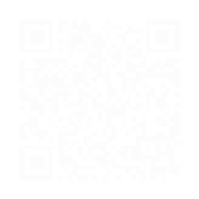
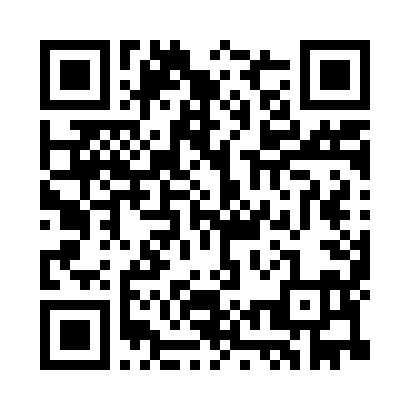

# Day -1 / HV20.(-1) Twelve steps of christmas

## Challenge

<!-- ...10....:...20....:...30....:...40....:...50....:...60....:...70....:. -->
* Author: Bread ([@nonsxd](https://twitter.com/nonsxd))
* Tags:   #fun
* Level:  easy

On the third day of christmas my true love sent to me...

three caesar salads,\
two to (the) six basic arguments,\
one quick response.

[Message](Message.txt)

## Solution

It's written right there `(^_^)`

> three casear salads

… means [Caesar Cipher] shifting the message text by 3. Afterwards the leading
sentence is readable.

[Caesar Cipher]: https://en.wikipedia.org/wiki/Caesar_cipher

> two to (the) six basic arguments,

… i.e. `2^6 = 64`, together with the word _basic_ means decoding with [base64].
The resulting binary is a [PNG] image file.

[PNG]: https://en.wikipedia.org/wiki/Portable_Network_Graphics
[base64]: https://en.wikipedia.org/wiki/Base64

> one quick response

… means [QR code]. But its just a white square ?! Well it not _absolutly_ white.
Streching out the grey levels (with Gimp) makes the QR code visible …

[QR code]: https://en.wikipedia.org/wiki/QR_code

<kbd></kbd>

||
|-

[label text]
|-

||
|-|-

The flag is obtained by scanning the QR code.

--------------------------------------------------------------------------------

Flag: `HV20{34t-sl33p-haxx-rep34t}`

