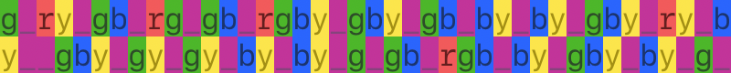

# Day 04 / HV20.04 Br❤️celet


## Challenge

<!-- ...10....:...20....:...30....:...40....:...50....:...60....:...70....:. -->
* Author: brp64 (with help of his daughter)
* Tags:   #fun
* Level:  easy

Santa was given a nice bracelet by one of his elves. Little does he know that
the secret admirer has hidden a message in the pattern of the bracelet...


#### Hints

_[These hints were added hours later as it became apparent that the challenge
was to difficult for the Easy category. I did not have the hints and that 
circumstance may reflects in my solution.]_

1. No internet is required - only the bracelet
2. The message is encoded in binary
3. Violet color is the delimiter
4. Colors have a fixed order
5. Missing colors matter


## Solution

<!-- ...10....:...20....:...30....:...40....:...50....:...60....:...70....:. -->
This challenge was hairy. But the first step I took was right: I wrote down the
sequence of the colored beads on the bracelet:

* `b` means `blue`
* `g` means `green`
* `p` means `purple`
* `r` means `red`
* `y` means `yellow`

<!--gprypgbprgpgbprgbypgbypgbpbypbypgbyprypbyppgbypgypgypbypbypgpgbprgbpbypgbypbypgp-->
{width=100%}

From here I went down multiple _wrong_ rabbit holes before finally seeing the
light.

#### Wrong rabbit holes

* Assumed that the challenge's is about a [base5]-system:\
  I thought that if there are 5 colors you could group all colors in bigrams
  (or pairs). For each bigram there would be `5 * 5 = 25` possibilities and that
  would make for a nice alphabet.
  [base5]: https://en.wikipedia.org/wiki/Quinary

  For example something like this

  |       |  b  |  g  |  p  |  r  |  y  |
  |-------|-----|-----|-----|-----|-----|
  | **b** |  A  |  B  |  C  |  D  |  E  |
  | **g** |  F  |  G  |  H  | I/J |  K  |
  | **p** |  L  |  M  |  N  |  O  |  P  |
  | **r** |  Q  |  R  |  S  |  T  |  U  |
  | **y** |  V  |  W  |  X  |  Y  |  Z  |

  But no matter how I arranged the alphabet, out came only garbage.

* I found a Wikipedia article about an encryption system using five characters.
  It's called [ADFGX] and was used by WWI soldiers.
  [ADFGX]: https://de.wikipedia.org/wiki/ADFGX

* Multiple meandering web searches.


#### Getting out by going deeper

<!-- ...10....:...20....:...30....:...40....:...50....:...60....:...70....:. -->
Things started to go in the right direction once I assumed that `p` is a
delimiter (as suggested by jokker, thx) and stubbornly went forward with that 
strategy.

``` shell
$ echo $color_beads | sed 's/p/_/g'
```

<!--g_ry_gb_rg_gb_rgby_gby_gb_by_by_gby_ry_by__gby_gy_gy_by_by_g_gb_rgb_by_gby_by_g_-->
{width=100%}

<!-- ...10....:...20....:...30....:...40....:...50....:...60....:...70....:. -->
If you stare at this pattern for a while you start to notice, that each
delimited group has the same internal ordering:

* `r` precedes `g`
* `g` precedes `b`
* `b` precedes `y`

Observing that pattern, I eventually had the idea, that each color `r`, `g`,
`b`, `y` represents a binary digit that is either present (meaning `1`) or
missing (meaning `0`). So each color stands for a power of 2:

* `y` = `2^0` = `1`
* `b` = `2^1` = `2`
* `g` = `2^2` = `4`
* `r` = `2^3` = `8`

``` shell
$ echo $color_beads | sed 's/p/_/g' \
  | sed 's/r/8/g' | sed 's/g/4/g' | sed 's/b/2/g' | sed 's/y/1/g'
```

<!--4_81_42_84_42_8421_421_42_21_21_421_81_21__421_41_41_21_21_4_42_842_21_421_21_4_-->
{width=100%}

Each group of numbers was then added up (by hand)…

<!--4_9._6._12_6._15.._7.._6._3._3._7.._9._3.0_7.._5._5._3._3._4_6._14._3._7.._3._4_-->
{width=100%}

…then converted to hexadecimal digits…

<!--4_9._6._c._6._f..._7.._6._3._3._7.._9._3.0_7.._5._5._3._3._4_6._e.._3._7.._3._4_-->
{width=100%}

…and the resulting bytes were ASCII encoded.

<!--I_.._l._.._o_....._v.._.._3._.._y.._.._0.._u.._.._S._.._4._._n._..._7._.._4.._._-->
{width=100%}

And there it is, the meat of the flag.

--------------------------------------------------------------------------------

Flag: `HV20{Ilov3y0uS4n74}`

