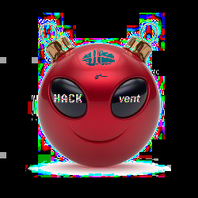

# Day 05 / HV20.05 Image DNA


## Challenge

<!-- ...10....:...20....:...30....:...40....:...50....:...60....:...70....:. -->
* Author: blaknyte0
* Tags:   #crypto #forensic
* Level:  easy

Santa has thousands of Christmas balls in stock. They all look the same, but he
can still tell them apart. Can you see the difference?

 


## Solution

Reading the title _Image DNA_ I immediately thought of a hashing algorithm for
visual similarity in pictures like [PhotoDNA](). Aaaaand that was a red herring.

[PhotoDNA]: https://en.wikipedia.org/wiki/PhotoDNA

Calculating the visual difference between the two pictures gave this:



Although it looks pretty glitchy hacky interesting, it doesn't help at all.

Doing a binary diff showed that the two files were almost completely diffrent.

Running _binwalk_ on the second image brought up a ZIP file containing a text
file with the name `A`. Inside the `A`-file was only the Text `00`. 

_Ok, then ?!_

``` shell
$ binwalk -e hv_ball_2.jpg

DECIMAL       HEXADECIMAL     DESCRIPTION
--------------------------------------------------------------------------------
0             0x0             JPEG image data, JFIF standard 1.01
8723          0x2213          Zip archive data, at least v2.0 to extract, uncompressed size: 3, name: A
8886          0x22B6          End of Zip archive, footer length: 22

$ cat A
00
```


#### Unexpected codes

<!-- ...10....:...20....:...30....:...40....:...50....:...60....:...70....:. -->

Looking through the image files with xxd(1) revealed some interesting codes. 
Both files contained character sequences that can be identified as 
DNA-sequences.

``` shell
$ xxd hv_ball_1.jpg
[…]
000020a0: 0a28 a280 0a28 a280 0a28 a280 0a28 a280  .(...(...(...(..
000020b0: 0a28 a280 0a28 a280 0a28 a280 0a28 a280  .(...(...(...(..
000020c0: 0a28 a280 0a28 a280 0a28 a280 0a28 a280  .(...(...(...(..
000020d0: 0a28 a280 0a28 a280 0a28 a280 0a28 a280  .(...(...(...(..
000020e0: 3fff d943 5447 5443 4743 4741 4743 4747  ?..CTGTCGCGAGCGG
000020f0: 4154 4143 4154 5443 4141 4143 4141 5443  ATACATTCAAACAATC
00002100: 4354 4747 4754 4143 4141 4147 4141 5441  CTGGGTACAAAGAATA
00002110: 4141 4143 4354 4747 4743 4141 5441 4154  AAACCTGGGCAATAAT
00002120: 5443 4143 4343 4141 4143 4141 4747 4141  TCACCCAAACAAGGAA
00002130: 4147 5441 4743 4741 4141 4141 4754 5443  AGTAGCGAAAAAGTTC
00002140: 4341 4741 4747 4343 4141 410a            CAGAGGCCAAA.

$ xxd hv_ball_2.jpg
[…]
00002150: 92b1 9595 0451 52b7 c1f7 228f 6b1f b99b  .....QR...".k...
00002160: fdbe 221e ee4b 4228 dfed 4000 c340 2895  .."..KB(..@..@(.
00002170: 90ab 857d cc42 e03d 6e72 5f86 9dfc ba22  ...}.B.=nr_...."
00002180: 9b45 f68a 6c45 ec8a d913 2449 7fa2 3fd4  .E..lE....$I..?.
00002190: 4ff8 503f d503 fd10 120e d82d 907b 205b  O.P?.......-.{ [
000021a0: 101d a05b 4a3f f83f ffd9 4154 4154 4154  ...[J?.?..ATATAT
000021b0: 4141 4143 4341 4754 5441 4154 4341 4154  AAACCAGTTAATCAAT
000021c0: 4154 4354 4354 4154 4154 4743 5454 4154  ATCTCTATATGCTTAT
000021d0: 4154 4754 4354 4347 5443 4347 5443 5441  ATGTCTCGTCCGTCTA
000021e0: 4347 4341 4343 5441 4154 4154 4141 4347  CGCACCTAATATAACG
000021f0: 5443 4341 5447 4347 5443 4143 4343 4354  TCCATGCGTCACCCCT
00002200: 4147 4143 5441 4154 5441 4343 5443 4154  AGACTAATTACCTCAT
00002210: 5443 0a50 4b03 0414 0008 0008 0026 a86f  TC.PK........&.o
00002220: 5100 0000 0000 0000 0003 0000 0001 0020  Q.............. 
00002230: 0041 5554 0d00 0708 89b1 5f37 edbb 5f31  .AUT......_7.._1
00002240: e7bb 5f75 780b 0001 04e8 0300 0004 e803  .._ux...........
00002250: 0000 3330 e002 0050 4b07 086f e3b9 e405  ..30...PK..o....
00002260: 0000 0003 0000 0050 4b01 0214 0314 0008  .......PK.......
00002270: 0008 0026 a86f 516f e3b9 e405 0000 0003  ...&.oQo........
00002280: 0000 0001 0020 0000 0000 0000 0000 00a4  ..... ..........
00002290: 8100 0000 0041 5554 0d00 0708 89b1 5f37  .....AUT......_7
000022a0: edbb 5f31 e7bb 5f75 780b 0001 04e8 0300  .._1.._ux.......
000022b0: 0004 e803 0000 504b 0506 0000 0000 0100  ......PK........
000022c0: 0100 4f00 0000 5400 0000 0000            ..O...T.....
``` 

<!-- ...10....:...20....:...30....:...40....:...50....:...60....:...70....:. -->
I tried multiple things a with the DNA-Sequences. For a while I firmly believed
that it had something to do with [Codons from dcode.fr](). Despite trying
everything imaginable in this regard, there was nothing to be gained in the end.

[Codons from dcode.fr]: https://www.dcode.fr/codons-genetic-code

After some web searching an [article]() was found that described what a very simple
encryption scheme involving DNA sequences.

[article]: https://www.geeksforgeeks.org/dna-cryptography/

It basicly works like OTP with extra steps to involve DNA-Sequences:

1. Write a message and choose an equally long sequence of random bytes.
   The message is the plain text and the random bytes the key.

2. XOR the two byte sequences. Thus producing the cipher byte sequence.

3. For the cipher text and the key, replace each bit pair with one of the 4 DNA
   building blocks (Adenine, Thymine, Cytosine and Guanin) with the following
   encoding scheme:

   * `00` becomes `A`
   * `01` becomes `T`
   * `10` becomes `C`
   * `11` becomes `G`

4. Your done


The following script was produced to do the the above in reverse order:

``` python
def bitstring_to_bytes(s):
    return int(s, 2).to_bytes(len(s) // 8, byteorder='big')

def byte_xor(ba1, ba2):
    return bytes([_a ^ _b for _a, _b in zip(ba1, ba2)])


dna1 = "CTGTCGCGAGCGGATACATTCAAACAATCCTGGGTACAAAGAATAAAACCTGGGCAATAATTCACCCAAACAAGGAAAGTAGCGAAAAAGTTCCAGAGGCCAAA"
dna2 = "ATATATAAACCAGTTAATCAATATCTCTATATGCTTATATGTCTCGTCCGTCTACGCACCTAATATAACGTCCATGCGTCACCCCTAGACTAATTACCTCATTC"

b = []

for c in dna1:
    if c == 'A':
        k = '00'
    elif c == 'C':
        k = '01'
    elif c == 'G':
        k = '10'
    elif c == 'T':
        k = '11'

    b.append(k)

dna1Bytes = bitstring_to_bytes("".join(b))

b = []

for c in dna2:
    if c == 'A':
        k = '00'
    elif c == 'C':
        k = '01'
    elif c == 'G':
        k = '10'
    elif c == 'T':
        k = '11'

    b.append(k)

dna2Bytes = bitstring_to_bytes("".join(b))

print()
print(byte_xor(dna1Bytes, dna2Bytes))
```

Running the script gave:

``` shell
$ python3 dna_script.py
b'HV20{s4m3s4m3bu7diff3r3nt}'
```

--------------------------------------------------------------------------------

Flag: `HV20{s4m3s4m3bu7diff3r3nt}`

