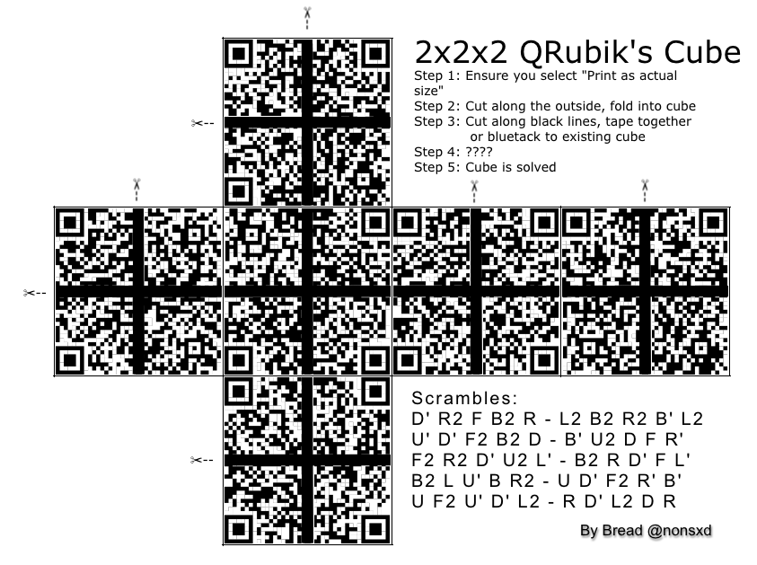
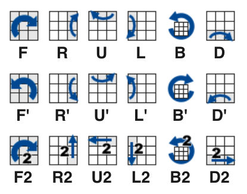
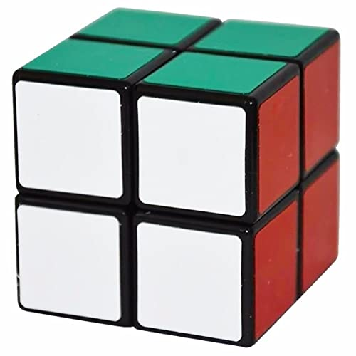
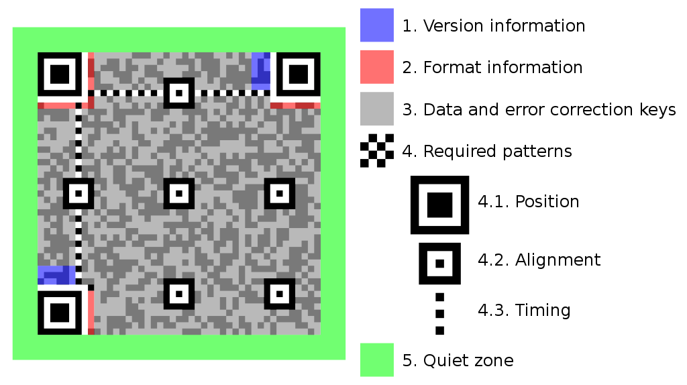
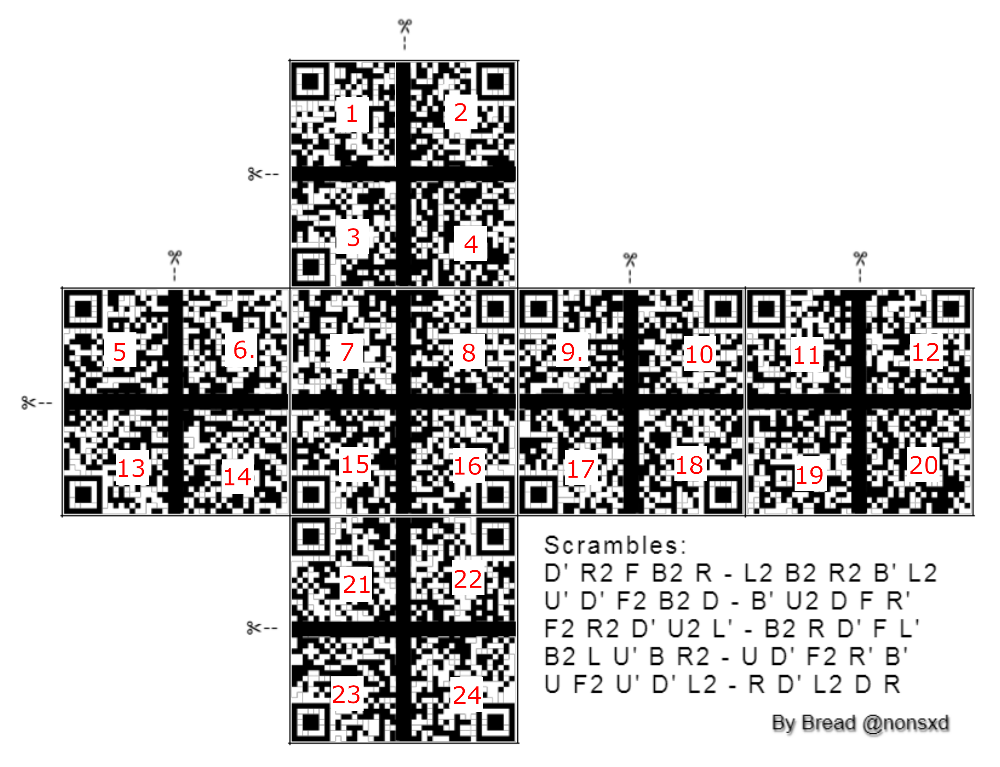
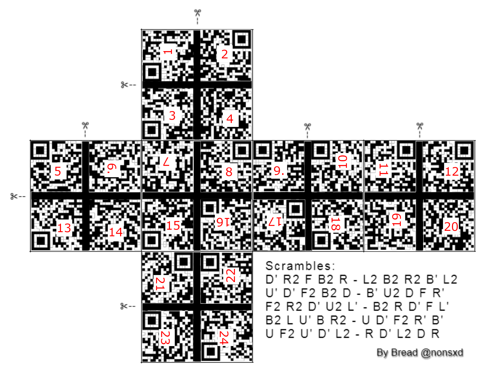
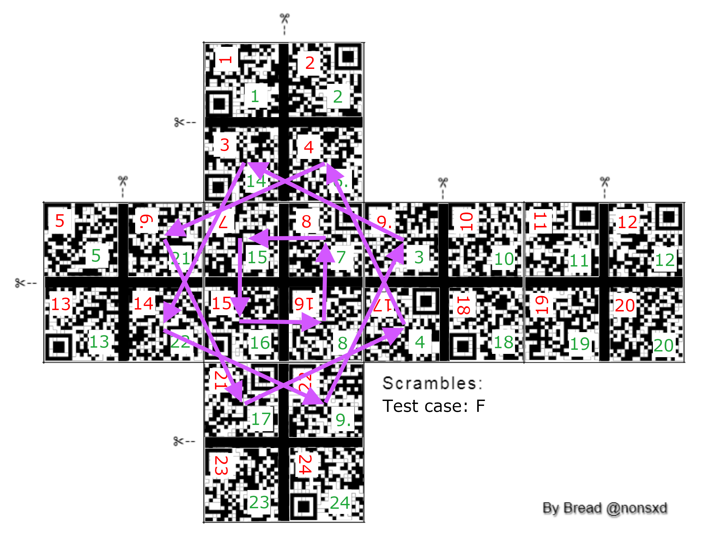
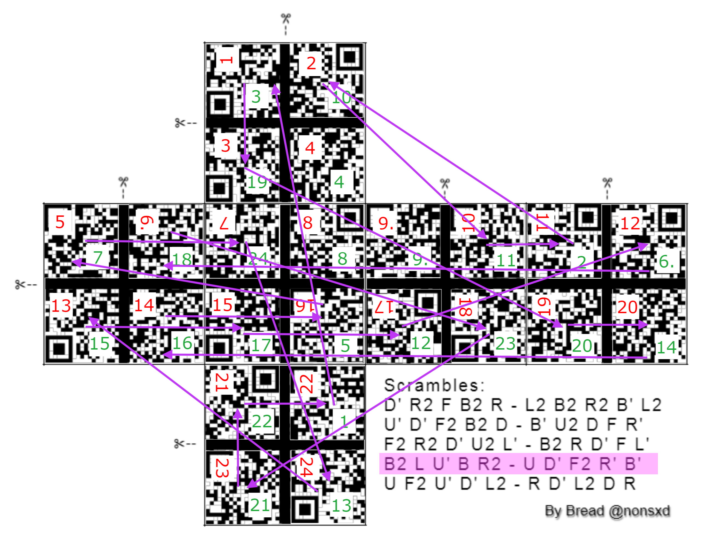
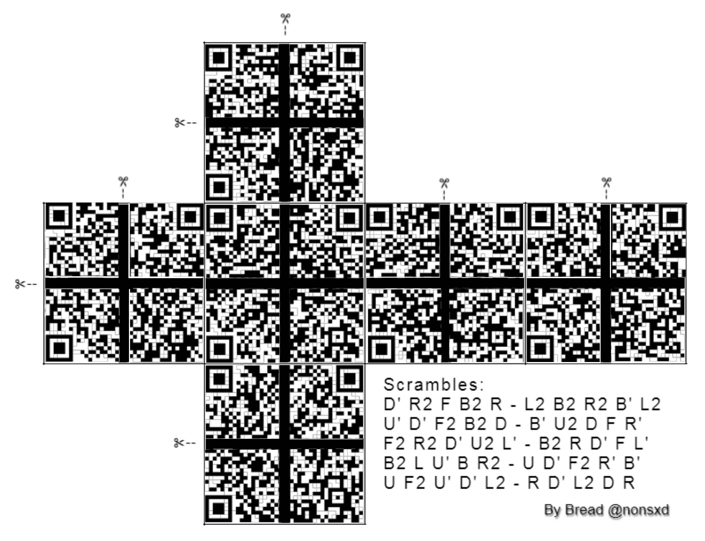

# Day 06 / HV20.06 Twelve steps of christmas


## Challenge

<!-- ...10....:...20....:...30....:...40....:...50....:...60....:...70....:. -->
* Author: Bread ([@nonsxd](https://twitter.com/nonsxd))
* Tags:   #fun
* Level:  medium

On the sixth day of Christmas my true love sent to me...

six valid QRs,\
five potential scrambles,\
four orientation bottom and right,\
and the rest has been said previously.

{width=100%}

[PDF version](QRubiksCube.pdf)\
[Source image](QRubiksCube.pxd) (open with [pixlr.com](https://pixlr.com/e/)


### Requirements

 printer


### Hints

_[These hints were added after I solved the challenge.]_

* selbmarcs
* The black lines are important - do not remove them


## Solution

<!-- ...10....:...20....:...30....:...40....:...50....:...60....:...70....:. -->
As the challenge text says, the goal is to unscramble a 2x2x2 Rubik's Cube in
order to get valid QR codes on all 6 _sides_ of the cube. Each _side_ is divided
into 4 _quadrants_. A little web search foo revealed that the sequences under
the title _Scrambles_ are a standardized way to describe cube movements. These
movments are usually meant for 3x3x3 Rubik's Cubes but they can also be applied
to 2x2x2 Rubik's Cubes:


| Code | Meaning        | Code | Meaning         | Code | Meaning         |
|------|----------------|------|-----------------|------|-----------------|
| `R`  | Right side 90° | `R'` | Right side -90° | `R2` | Right side 180° |
| `L`  | Left  side 90° | `L'` | Left  side -90° | `L2` | Left  side 180° |
| `U`  | Upper side 90° | `U'` | Upper side -90° | `U2` | Upper side 180° |
| `D`  | Down  side 90° | `D'` | Down  side -90° | `D2` | Down  side 180° |
| `F`  | Front side 90° | `F'` | Front side -90° | `F2` | Front side 180° |
| `B`  | Back  side 90° | `B'` | Back  side -90° | `B2` | Back  side 180° |

{width=50%} {width=40%}

For more details see: <https://ruwix.com/the-rubiks-cube/notation/>


### All that matters

Before diving into solving the challenge I tried to make sure that I'm aware
of everything that has an influence on the results.

<!-- ...10....:...20....:...30....:...40....:...50....:...60....:...70....:. -->

* Do I need to **do** or **undo** a scramble ?\
  I need to undo a scramble, I guess.

* Was **just one line** of scramble movments applied **or all of them** ?\
  The challenge text said "five _potential_ scrambles". I'm pretty sure it's
  just one.

* What about the **dash `-`** in the middle of each scramble line ?\
  That's probably just to ease reading the scramble sequence.

* **Which side** of the cube **is facing me** while undoing the scramble ?\
  All Rubik's Cube tutorials that I found assumed that the side marked with `X`
  is facing me:

  ```
         .---.
         |   |
     .---:---:---.---.
     |   | X |   |   |
     '---:---:---'---'
         |   |
         '---'
  ```
  
  So I went with that.

  _[After having solved the challenge I picked up, that the line "four
  orientation bottom and right," from the challenge text should have been a hint
  for this orientation problem. But I honestly still don't understand it ;-) ]_

<!-- ...10....:...20....:...30....:...40....:...50....:...60....:...70....:. -->
* Could it be that the **quadrants** themselfs have also been **rotated** ?\
  I cannot rule out that one. _But_ I can orient every quadrant independently.
  All QR codes have _position_, _alignment_ and _timing_ markings that allow to
  orient each quadrant without it being part of a whole QR code.

  {width=50%}

* What about the **black crosses** on each side ?\
  In the beginning I was worried about those. I thought I may have to stitch the
  quardants closer together or something. I decided to handle that problem later.


### Mise en place

I had neither a printer nor a Rubik's Cube available. I was sure that trying to
solve the cube in my head was way too difficult and error prone. The next best 
thing to an actual Rubik's Cube I could think of were 8 stacked dice. I applied
adhesive labels with numbers onto the dice instead of the actual QR codes.

This is the numbering scheme I choose. Beneath it is a photo of the labeled
dice.

{width=62%} {width=33%}

Next I used Gimp to rotate all QR code fragments in order to orient them
correctly. The rotated numbers in indicate which quadrants had to be reoriented.

{width=100%}


### Doing a test

<!-- ...10....:...20....:...30....:...40....:...50....:...60....:...70....:. -->
My strategy was to

* replay a scramble sequence with the pseudo Rubik's Cube made of dice, 
* write down where all the numbers ended up in green 
* and from there backtrace the original arrangement. 
* Then restore the original arrangement in Gimp. 

If the right scramble is chosen, the QR codes should emerge.

To get a grasp on how to read the numbers, I created **a test case whose
scramble had only one move**: turn the front 90° clock wise. The following rules 
on how to read the numbers were derived from this test.

* Choose a quadrant and read its _green_ number.
* Move the quadrant to the position with the same _red_ number.

{width=100%}

Clearly the quadrant movements indicated by the arrows undo the scamble.


### Actually solving it

The solving strategy has a neat feature. It's not necessary to play through a
whole unscramble to detect that it's the _wrong_ one. It usually shows within
the first few quadrant movements, when a QR fragment ends up in an impossible 
quadrant. For example when a top-left QR fragment ends up in a top-right
quadrant, you already know that the wrong scramble was chosen.

The **4th scramble** turned out to be the right one. Behold the overly
complicated unscramble arrow diagram …

{width=100%}

… and the result after restoring the original arrangement:

{width=100%}

At this point it turned out that the black crosses are actually _needed_ to 
successfully scan the QR codes. The missing pixels underneath the black crosses
are recovered by the inherent error correction of the QR codes. Pretty cool.

Scanning the six QR codes top to bottom, left to right gave the following strings:

```
Petrus_is
_be_proud.
HV20{Erno_
Rubik_would
#HV20QRubicsChal}
_Valid.
```

With a little bit of trial and error, the final flag can be put together from
these text fragments.

--------------------------------------------------------------------------------

Flag: `HV20{Erno_Rubik_would_be_proud.Petrus_is_Valid.#HV20QRubicsChal}`

