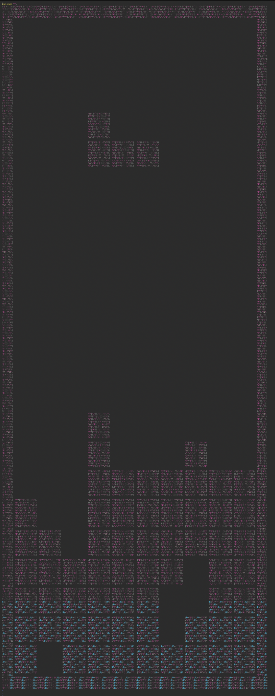

# Day 08 / HV20.08 The game


## Challenge

<!-- ...10....:...20....:...30....:...40....:...50....:...60....:...70....:. -->
* Author: M (who else)
* Tags:   #reverse-engineering #fun
* Level:  medium

Let's play another little game this year. Once again, as every year, I promise
it is hardly obfuscated.

[Download](download.txt)


### Requirements

Perl & `Term::ReadKey` module (from CPAN or `apt install libterm-readkey-perl`
for debian / ubuntu based systems)


## Solution

First this: If you zoom out of the source code really far by reducing the 
font size, you will – after a while – get to see this glorious look out:



How cool is that! `B-)`

About solving the challenge: I deobfuscated the code with [decode-stunix.pl](http://perlobfuscator.com/decode-stunnix-5.17.1.pl).

The only things that I changed from there on out were:

1. a much longer playing field
2. better colors through terminal settings

The rest was just playing the game and taking notes of the characters until
the URL was complete.

Here is the deobfuscated and slightly modified game code:

```perl
use Term::ReadKey;
ReadMode(5);
$| = 1;
print "\ec\e[2J\e[?25l\e[?7l\e[1;1H\e[0;0r";
@FF = split(//, '####H#V#2#0#{#h#t#t#p#s#:#/#/#w#w#w#.#y#o#u#t#u#b#e#.#c#o#m#/#w#a#t#c#h#?#v#=#d#Q#w#4#w#9#W#g#X#c#Q#}####', 0);
@BB = (89, 51, 30, 27, 75, 294);
$w = 11;
$h = 100;
print "\e[1;1H\e[103m" . ' ' x (2 * $w + 2) . "\e[0m\r\n" . ("\e[103m \e[0m" . ' ' x (2 * $w) . "\e[103m \e[0m\r\n") x $h . "\e[103m" . ' ' x (2 * $w + 2) . "\e[2;1H\e[0m";
sub bl {
    ($b, $bc, $bcc, $x, $y) = @_;
    foreach $yy (0 .. 2) {
        foreach $xx (0 .. 5) {
            print "\e[${bcc}m\e[" . ($yy + $y + 2) . ';' . ($xx + $x * 2 + 2) . "H$bc" if ($b & 7 << $yy * 3) >> $yy * 3 & 4 >> ($xx >> 1);
        }
    }
}
sub r {
    $_ = shift();
    ($_ & 4) << 6 | ($_ & 32) << 2 | ($_ & 256) >> 2 | ($_ & 2) << 4 | $_ & 16 | ($_ & 128) >> 4 | ($_ & 1) << 2 | ($_ & 8) >> 2 | ($_ & 64) >> 6;
}
sub _s {
    ($b, $bc, $x, $y) = @_;
    foreach $yy (0 .. 2) {
        foreach $xx (0 .. 5) {
            substr($f[$yy + $y], $xx + $x, 1) = $bc if ($b & 7 << $yy * 3) >> $yy * 3 & 4 >> $xx;
        }
    }
    $Q = 'QcXgWw9d4';
    @f = grep({/ /;} @f);
    unshift @f, ' ' x $w while @f < $h;
    p();
}
sub cb {
    $_Q = 'ljhc0hsA5';
    ($b, $x, $y) = @_;
    foreach $yy (0 .. 2) {
        foreach $xx (0 .. 2) {
            return 1 if ($b & 7 << $yy * 3) >> $yy * 3 & 4 >> $xx and $yy + $y >= $h || $xx + $x < 0 || $xx + $x >= $w || substr($f[$yy + $y], $xx + $x, 1) ne ' ';
        }
    }
}
sub p {
    foreach $yy (0 .. $#f) {
        print "\e[" . ($yy + 2) . ";2H\e[0m";
        $_ = $f[$yy];
        s/./$&$&/g;
        print $_;
    }
}
sub k {
    $k = '';
    $k .= $c while $c = ReadKey(-1);
    $k;
}
sub n {
    $bx = 5;
    $by = 0;
    $bi = int rand scalar @BB;
    $__ = $BB[$bi];
    $_b = $FF[$sc];
    $sc == 98 and $_b =~ s/./0/ unless $sc > 77 and $sc < 98 and $sc != 82 and eval '$_b' . "=~y#$Q#$_Q#";
    $sc++;
}
@f = (' ' x $w) x $h;
p ;
n ;
while (1) {
    $k = k();
    last if $k =~ /q/;
    $k = substr($k, 2, 1);
    $dx = ($k eq 'C') - ($k eq 'D');
    $bx += $dx unless cb $__, $bx + $dx, $by;
    if ($k eq 'A') {
        if (not cb(r($__), $bx, $by)) {
            $__ = r($__);
        }
        elsif (not cb(r($__), $bx + 1, $by)) {
            $__ = r($__);
            ++$bx;
        }
        elsif (not cb(r($__), $bx - 1, $by)) {
            $__ = r($__);
            --$bx;
        }
    }
    bl $__, $_b, 101 + $bi, $bx, $by;
    select undef, undef, undef, 0.1;
    if (cb $__, $bx, ++$by) {
        last if $by < 2;
        _s $__, $_b, $bx, $by - 1;
        n ;
    }
    else {
        bl $__, ' ', 0, $bx, $by - 1;
    }
}
sleep 1;
ReadMode(0);
print "\ec";
```

--------------------------------------------------------------------------------

Flag: `HV20{https://www.youtube.com/watch?v=Alw5hs0chj0}`

