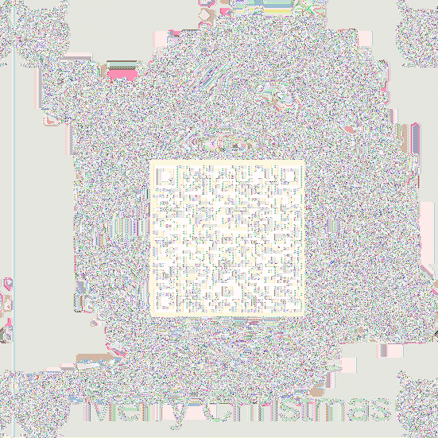
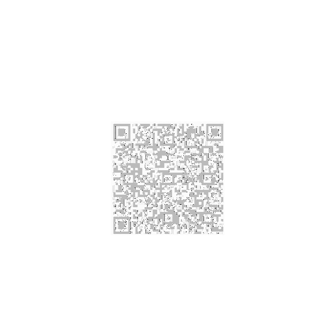

[← Day 12](../day12/) / [↑ TOC](../README.md) / [→ Day 14](../day14/)


# Day 13 / HV20.13 Twelve steps of christmas


## Challenge

<!-- ...10....:...20....:...30....:...40....:...50....:...60....:...70....:. -->
* Author: Bread ([@nonsxd](https://twitter.com/nonsxd))
* Tags:   `#forensic` `#crypto`
* Level:  Hard

On the ninth day of Christmas my true love sent to me...

nineties style xls,
eighties style compression,
seventies style crypto,
and the rest has been said previously.

[Download](Download.xls)


### Hints

Wait, Bread is on the Nice list? Better check that comment again...


## Solution

The Excel file has a sheet password. To make the contents of the Excel file
accessible without knowing the sheet password, it is sufficient to simply select
everything `[Ctrl] + [A]`, copy it to the clip board and paste it into a new
Excel file.


### Bread's cell

As hinted by the challenge text, _C9_ is a special cell. It's Bread's cell. Its
contents are …

```
Not a loaf of bread which is mildly disappointing 1f 9d 8c 42 9a 38 41 24 01 80
41 83 8a 0e f2 39 78 42 80 c1 86 06 03 00 00 01 60 c0 41 62 87 0a 1e dc c8 71 23
Why was the loaf of bread upset? His plan were always going a rye. How does
bread win over friends? “You can crust me.” Why does bread hate hot weather? It
just feels too toasty.
```

The hex values are extracted … 

```
1f 9d 8c 42 9a 38 41 24 01 80 41 83 8a 0e f2 39 78 42 80 c1 86 06 03 00 00 01 60
c0 41 62 87 0a 1e dc c8 71 23
```

… and poured into a file as binary. Asking _file(1)_ what kind it is gives a
vague result …

```sh
$ echo "1f 9d 8c 42 9a 38 41 24 01 80 41 83 8a 0e f2 39 78 42 80 c1 86 06 03 00 00 01 60 c0 41 62 87 0a 1e dc c8 71 23" \
| xxd -p -r > strange_file.bin

$ file strange_file.bin
strange_file.bin: compress'd data 12 bits
```

[Magic from Cyberchef]() says it's a _tar_ file and it can be unpacked as
that …

[Magic from Cyberchef]: https://gchq.github.io/CyberChef/#recipe=From_Hex('Auto')Magic(3,false,false,'')&input=MWYgOWQgOGMgNDIgOWEgMzggNDEgMjQgMDEgODAgNDEgODMgOGEgMGUgZjIgMzkgNzggNDIgODAgYzEgODYgMDYgMDMgMDAgMDAgMDEgNjAgYzAgNDEgNjIgODcgMGEgMWUgZGMgYzggNzEgMjM

```sh
$ mv strange_file.bin strange_file.tar

$ open strange_file.tar

$ file strange_file
strange_file: PC bitmap, Windows 98/2000 and newer format, 551 x 551 x 32

$ xxd strange_file
00000000: 424d 4e88 1200 0000 0000 8a00 0000 7c00  BMN...........|.
00000010: 0000 2702 0000 2702 0000 0100 2000 0300  ..'...'..... ...
00000020: 0000 c487 1200 0000 0000 0000 0000 0000  ................
00000030: 0000 0000 0000                           ......

$ mv strange_file bmp_header.bin
```

A new file emerges that seems to be a bitmap file or rather the header fragment
of a bitmap file.


### OLE objects

<!-- ...10....:...20....:...30....:...40....:...50....:...60....:...70....:. -->
Other than Bread's cell, there is an [OLE object] in the `Download.xls`. It's
neatly placed over the picture of a gift box in order to appear to be the gift
in the box …

[OLE object]: https://en.wikipedia.org/wiki/Object_Linking_and_Embedding


The OLE object can be extracted with [oletools] …

[oletools]: https://pypi.org/project/oletools/

```sh
$ oleobj Download.xls
oleobj 0.56 - http://decalage.info/oletools
THIS IS WORK IN PROGRESS - Check updates regularly!
Please report any issue at https://github.com/decalage2/oletools/issues

-------------------------------------------------------------------------------
File: 'Download.xls'
extract file embedded in OLE object from stream 'MBD018CB2C0/\x01Ole10Native':
Parsing OLE Package
Filename = "part9"
Source path = "D:\CTFS\HackVent\2020\Source\twelve-steps-of-christmas\part3\resources\part9"
Temp path = "C:\Users\bread\AppData\Local\Temp\{D7B743FA-2123-41EA-A49F-4B7EF5005334}\part9"
saving to file Download.xls_part9

$ file Download.xls_part9
Download.xls_part9: ASCII text

$ head -10 Download.xls_part9 
1f9d8c53c2b0a15386cc972f5cd49d0a25e203051c30ee4492836c4ba141
d17c08d294ee453501641e0819d7a5950d37ec32fc21f6af97303b6cb811
a0464a85025e566e7da8c30a8cae553977f6fcd960cdb23d99ce9c91b461
430a0686da70c046a28e1533041464421694a74fa03abdfeec3a14acd0af
64bf8a29208693255d8a3ca51d1bb6ec5cb362f1daad8b962fddb37ff3ea
91c7ed00af418692d86b52684f9563ccc6a1aba5e28c912a81ca5c62410d
449f092da40d59544986b5219744e8ba5264c58d5c81f60d40f30b96816e
d0e4d599176f03a6770306e8cb3042862f08d5487003264f9c0717054af4
1b96c507aa362f781da865c7dfbf57fc74558272e9d40f60fd7215826482
4b3b122d7629b044c9de164714c8954013624b982d043473843c011063c0
[…]
```

`Download.xls_part9` seems to be a Hex encoded file. Decoding it and sending it
through _file(1)_ and _xxd(1)_ reveals that again it's a compressed archive file
of sorts …

```sh
$ xxd -p -r Download.xls_part9 > Download.xls_part9.bin

$ file Download.xls_part9.bin 
Download.xls_part9.bin: compress'd data 12 bits

$ xxd Download.xls_part9.bin | head -n 10
00000000: 1f9d 8c53 c2b0 a153 86cc 972f 5cd4 9d0a  ...S...S.../\...
00000010: 25e2 0305 1c30 ee44 9283 6c4b a141 d17c  %....0.D..lK.A.|
00000020: 08d2 94ee 4535 0164 1e08 19d7 a595 0d37  ....E5.d.......7
00000030: ec32 fc21 f6af 9730 3b6c b811 a046 4a85  .2.!...0;l...FJ.
00000040: 025e 566e 7da8 c30a 8cae 5539 77f6 fcd9  .^Vn}.....U9w...
00000050: 60cd b23d 99ce 9c91 b461 430a 0686 da70  `..=.....aC....p
00000060: c046 a28e 1533 0414 6442 1694 a74f a03a  .F...3..dB...O.:
00000070: bdfe ec3a 14ac d0af 64bf 8a29 2086 9325  ...:....d..) ..%
00000080: 5d8a 3ca5 1d1b b6ec 5cb3 62f1 daad 8b96  ].<.....\.b.....
00000090: 2fdd b37f f3ea 91c7 ed00 af41 8692 d86b  /..........A...k
[…]
```

<!-- ...10....:...20....:...30....:...40....:...50....:...60....:...70....:. -->
After some trial and error it was discovered that the 7-Zip tool on Windows can
decompress the file. The archive contains a single file with the name `part9~`
and has some weird encryption (probably 70ies encryption ?) …

```sh
$ file part9~
part9~: openssl enc'd data with salted password

$ xxd part9~ | head -n 40
00000000: 5361 6c74 6564 5f5f 5cea a7a1 221f 1438  Salted__\..."..8
00000010: 3077 9172 c85b 8583 d13e 829a e92f d502  0w.r.[...>.../..
00000020: 640f 42e3 5dad 366e ec19 7fc4 ffbd c276  d.B.].6n.......v
00000030: 6cdc 04d4 a42a 0abc 56b7 1f75 ac60 baab  l....*..V..u.`..
00000040: 56b7 1f75 ac60 baab 0d6b cb7b 9967 6792  V..u.`...k.{.gg.
00000050: 1b1b 290c 866d 1cd8 2475 5666 040a 99c8  ..)..m..$uVf....
00000060: 56b7 1f75 ac60 baab 56b7 1f75 ac60 baab  V..u.`..V..u.`..
00000070: 56b7 1f75 ac60 baab 56b7 1f75 ac60 baab  V..u.`..V..u.`..
00000080: 56b7 1f75 ac60 baab 6205 629c 96ba 8a9e  V..u.`..b.b.....
00000090: 56b7 1f75 ac60 baab 56b7 1f75 ac60 baab  V..u.`..V..u.`..
000000a0: 56b7 1f75 ac60 baab 56b7 1f75 ac60 baab  V..u.`..V..u.`..
000000b0: 56b7 1f75 ac60 baab 56b7 1f75 ac60 baab  V..u.`..V..u.`..
000000c0: 56b7 1f75 ac60 baab 56b7 1f75 ac60 baab  V..u.`..V..u.`..
000000d0: 56b7 1f75 ac60 baab 7af2 dc07 bc83 8649  V..u.`..z......I
000000e0: f64d 857b 55c7 cce3 e8b5 2a67 4655 8165  .M.{U.....*gFU.e
000000f0: 972c d420 7d13 2dd2 438b 9532 d643 9722  .,. }.-.C..2.C."
00000100: ba57 452b 37b9 81fb 0368 bfb0 06dd d0f2  .WE+7....h......
00000110: 75f3 f11b 98ef 0303 fa19 2332 be10 d524  u.........#2...$
00000120: dcc0 f2e2 1e2e 0525 fdc3 593e a86d 2fbc  .......%..Y>.m/.
00000130: 07b5 76fe ffaf fcba 9550 97a7 3fc0 fdb9  ..v......P..?...
00000140: 8590 265c ed24 2dbb 0a96 94f6 5b8e 14e4  ..&\.$-.....[...
00000150: 2568 215b 615b 04cd 47f2 01c4 06f7 94b3  %h![a[..G.......
00000160: 2179 5bd9 a1a0 098c f1c4 45f5 5e7b f128  !y[.......E.^{.(
00000170: 6d77 c963 796c 4e96 56b7 1f75 ac60 baab  mw.cylN.V..u.`..
00000180: 56b7 1f75 ac60 baab 56b7 1f75 ac60 baab  V..u.`..V..u.`..
00000190: 56b7 1f75 ac60 baab 56b7 1f75 ac60 baab  V..u.`..V..u.`..
000001a0: 56b7 1f75 ac60 baab 56b7 1f75 ac60 baab  V..u.`..V..u.`..
000001b0: 56b7 1f75 ac60 baab 56b7 1f75 ac60 baab  V..u.`..V..u.`..
000001c0: 56b7 1f75 ac60 baab 56b7 1f75 ac60 baab  V..u.`..V..u.`..
000001d0: 56b7 1f75 ac60 baab 56b7 1f75 ac60 baab  V..u.`..V..u.`..
000001e0: 56b7 1f75 ac60 baab 56b7 1f75 ac60 baab  V..u.`..V..u.`..
000001f0: 56b7 1f75 ac60 baab 56b7 1f75 ac60 baab  V..u.`..V..u.`..
00000200: 56b7 1f75 ac60 baab 56b7 1f75 ac60 baab  V..u.`..V..u.`..
00000210: 56b7 1f75 ac60 baab 56b7 1f75 ac60 baab  V..u.`..V..u.`..
00000220: 56b7 1f75 ac60 baab 56b7 1f75 ac60 baab  V..u.`..V..u.`..
00000230: 56b7 1f75 ac60 baab 56b7 1f75 ac60 baab  V..u.`..V..u.`..
00000240: 56b7 1f75 ac60 baab 56b7 1f75 ac60 baab  V..u.`..V..u.`..
00000250: 56b7 1f75 ac60 baab 56b7 1f75 ac60 baab  V..u.`..V..u.`..
00000260: 56b7 1f75 ac60 baab 56b7 1f75 ac60 baab  V..u.`..V..u.`..
00000270: 56b7 1f75 ac60 baab 56b7 1f75 ac60 baab  V..u.`..V..u.`..
[…]
```

<!-- ...10....:...20....:...30....:...40....:...50....:...60....:...70....:. -->
It looks too orderly for an encrypted file. Maybe it's an image file that was 
[ECB] encrypted ? In that case, the contents may become visible simply by
adding a suitable HEADER. MAYBE A BMP HEADER ? DO WE HAVE SOMETHING LIKE THAT
LIEING AROUND ? :-D

[ECB]: https://en.wikipedia.org/wiki/Block_cipher_mode_of_operation#ECB

Experimentally placing the BMP header in front of the encrypted file with
different offsets gives images like the following …




After selecting a decent one and cleaning it further with Gimp (see file
[`flag.xcf`](flag.xcf)), it was possible to scan the QR code and get hold of the
flag …

| 
|-

--------------------------------------------------------------------------------

Flag: `HV20{U>watchout,U>!X,U>!ECB,Im_telln_U_Y.HV2020_is_comin_2_town}`

[← Day 12](../day12/) / [↑ TOC](../README.md) / [→ Day 14](../day14/)
