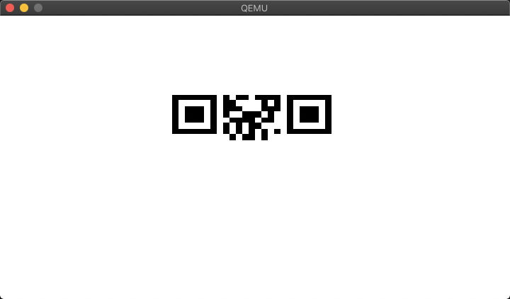

# Day 14 / HV20.14 Santa's Special GIFt


## Challenge

<!-- ...10....:...20....:...30....:...40....:...50....:...60....:...70....:. -->
* Author: The Compiler ([@the_compiler](https://twitter.com/the_compiler),
                        <https://bruhin.software/>)
* Tags:   #reverse-engineering #forensic
* Level:  hard

Today, you got a strange GIFt from Santa:


You are unsure what it is for. You do happen to have some wood lying around, but
the tool seems to be made for metal. You notice how it has a rather strange size.
You could use it for your fingernails, perhaps? If you keep looking, you might
see some other uses...


## Solution

Two things about this GIF file were curious:

1. It's exactly 512 bytes long.
2. It ends with the boot signature `0x55aa`

Both are features of a [MBR - Master Boot Record](). And since the challenge text
said, that it's "made for metal", maybe it's made for bare metal ? ;-)

[MBR - Master Boot Record]: https://en.wikipedia.org/wiki/Master_boot_record

MBRs contain real mode 16-bit x86 code from address 0x0000 up to 0x01b7. So this
file probably has some executable tricks up its sleeve.

The next step was having a look into the file with Ghidra because I didn't not
yet know how to run and debug this marvelous thing. It definitely looked like a
program but I could not really understand what it does.

After some well formed web search entries I had found a way to run the MBR.
There was this [short tutorial on debugging the early boot process]()
with _qemu_ and _gdb_.

[short tutorial on debugging the early boot process]: https://rwmj.wordpress.com/2011/10/12/tip-debugging-the-early-boot-process-with-qemu-and-gdb/

You load the MBR into a _qemu_ virtual machine in one terminal …

```sh
$ qemu-system-x86_64 -s -S -m 512 -hda file.gif
```
… and start it via _gdb_ from another terminal …

```sh
$ gdb
(gdb) target remote localhost:1234
(gdb) set architecture i8086
(gdb) cont
```

The following screenshot is the output that the MBR produces. It looks like an
unfinished QR code:



The unfinished QR code has a side length of 25. That means that the height
should also be 25. Maybe the number controlling the number of lines can be
altered to make the drawing process go through.

At address `0x005b` there seems to be a value `0xe0` that could be lowered
to `0x00`. This way the comparison would take more iterations to reach 
equality and keep the program from halting.

```sh
$ dd if=file.gif bs=1 count=93 > mod_file.gif

$ printf "\x00" >> mod_file.gif

$ dd if=file.gif bs=1 skip=94 >> mod_file.gif
```

Running the modified MBR:

```sh
$ qemu-system-x86_64 -s -S -m 512 -hda file.gif
```

```
$ gdb
(gdb) target remote localhost:1234
(gdb) set architecture i8086
(gdb) cont
```

… indeed. The whole QR code is now printed …


--------------------------------------------------------------------------------

Flag: `HV20{54n74'5-m461c-b00t-l04d3r}`

