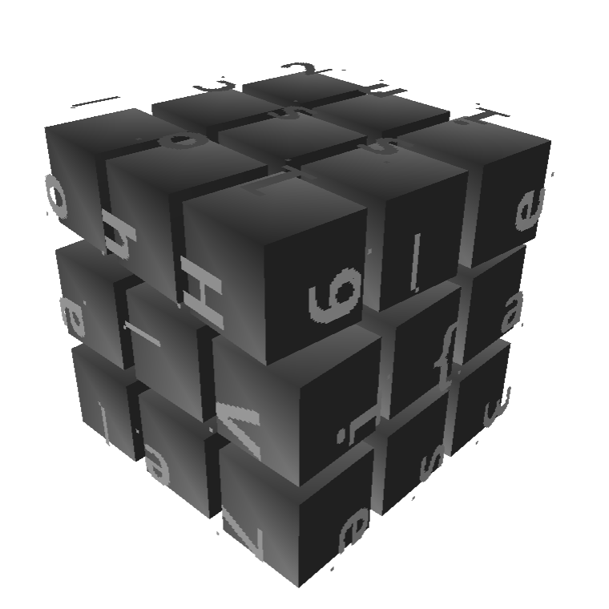
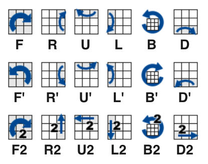
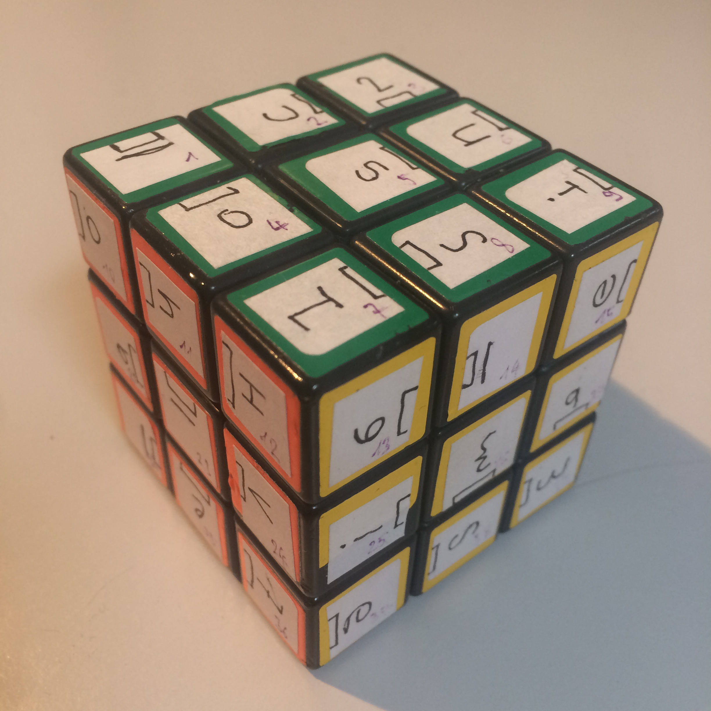
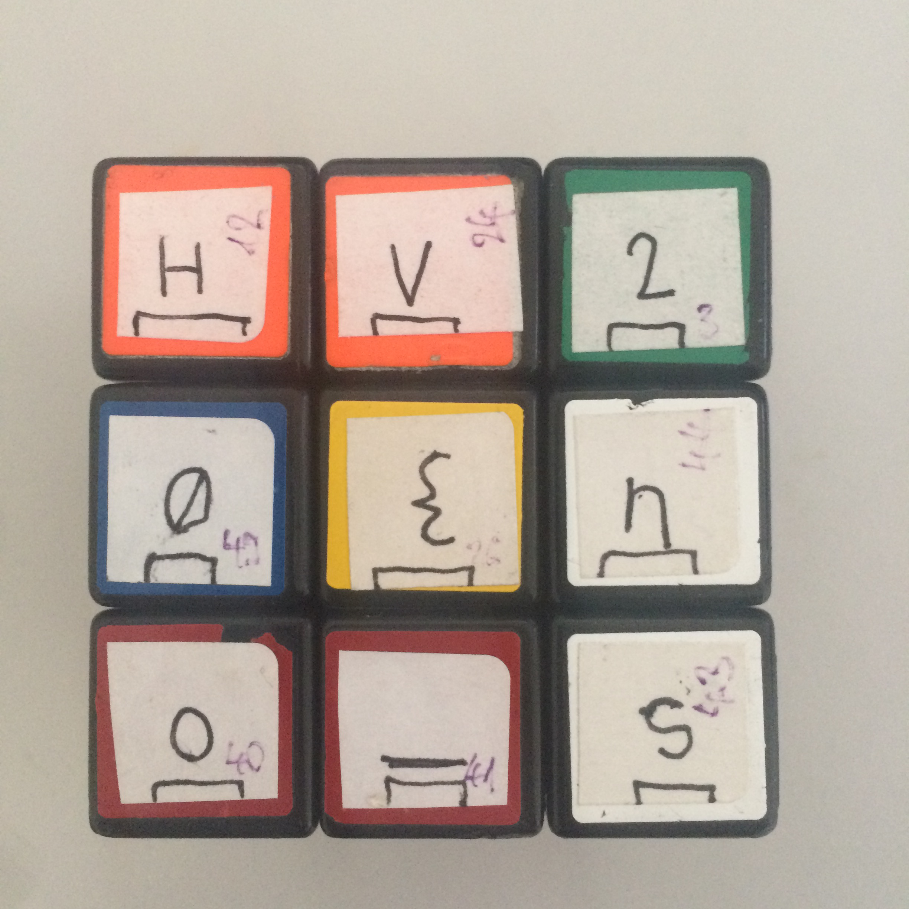
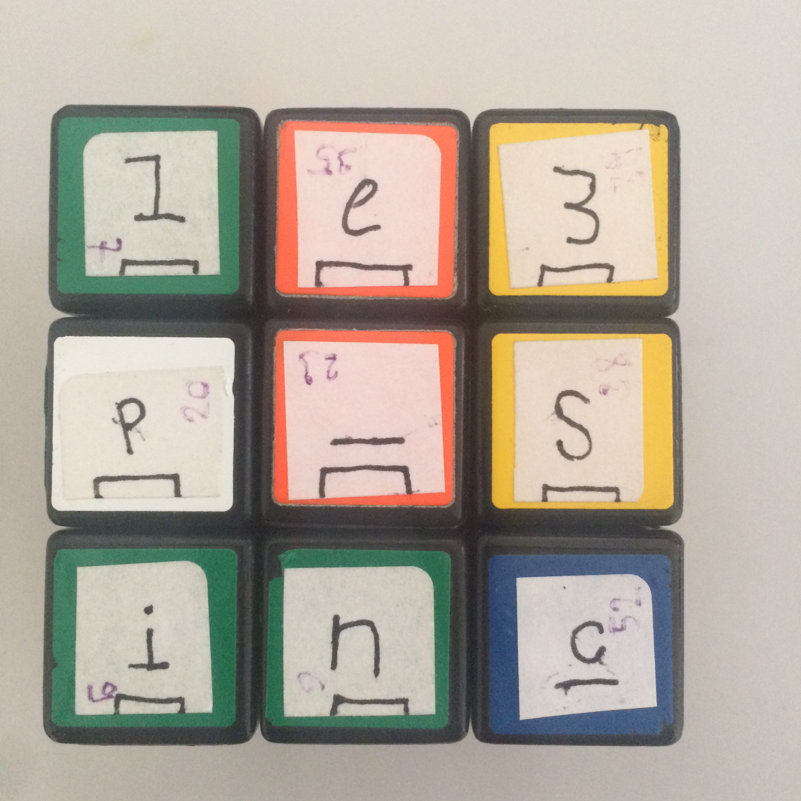
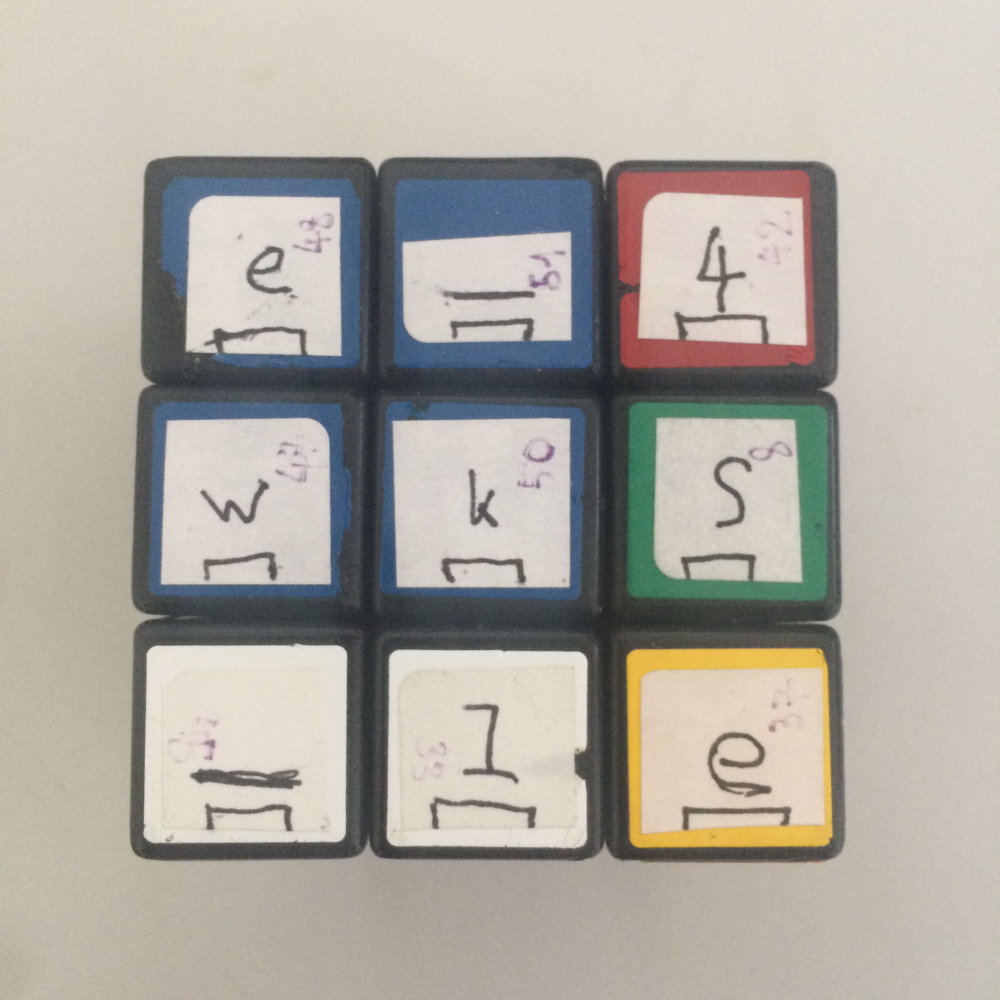
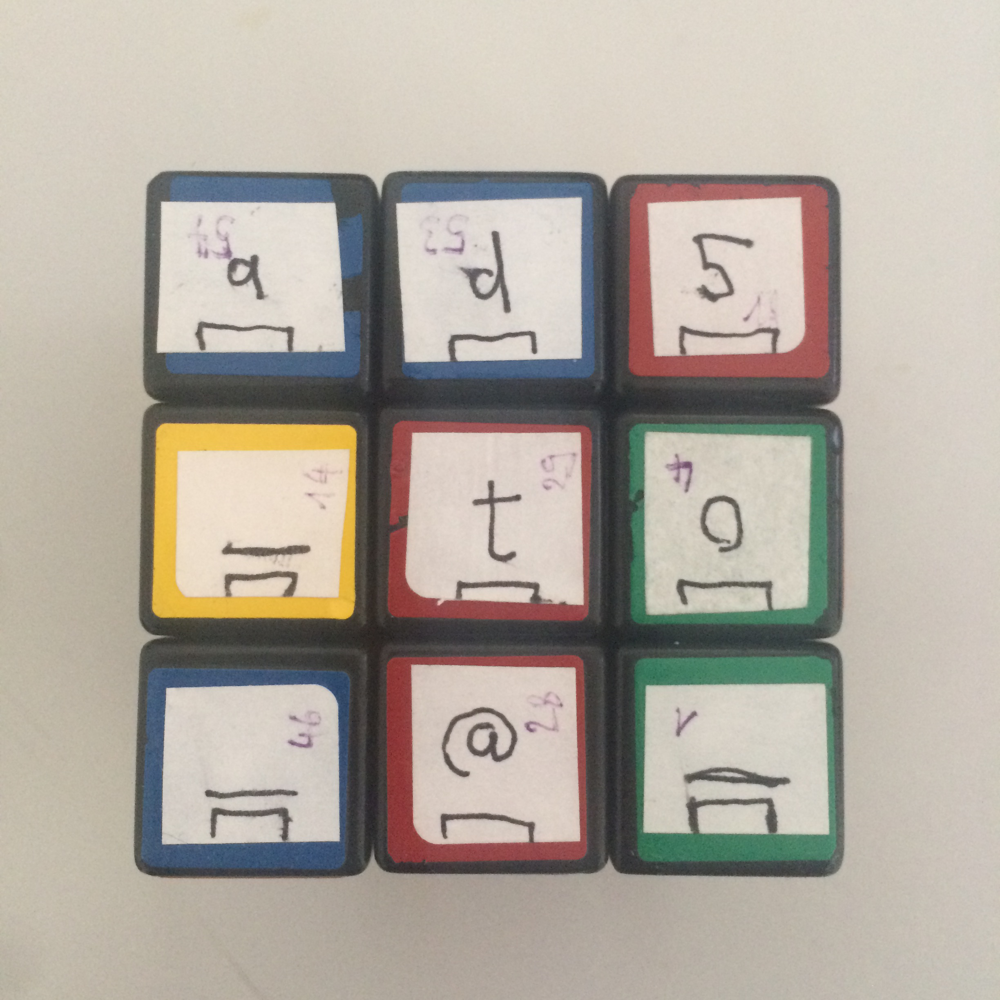
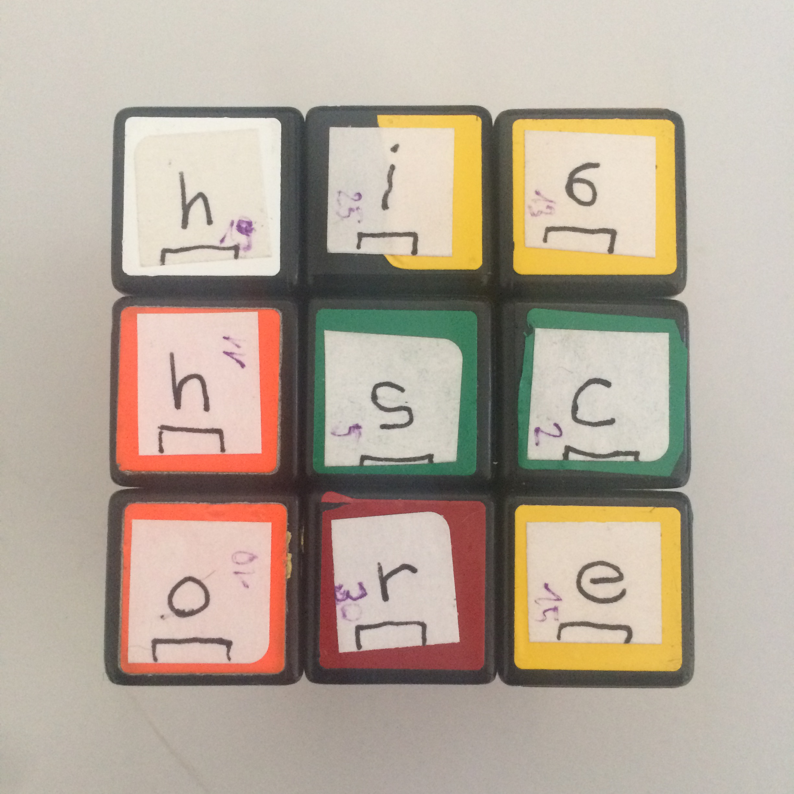

# Day 16 / HV20.16 Naughty Rudolph


## Challenge

<!-- ...10....:...20....:...30....:...40....:...50....:...60....:...70....:. -->
* Author: dr_nick
* Tags:   #fun #programming
* Level:  hard

Santa loves to keep his personal secrets on a little toy cube he got from a kid
called Bread. Turns out that was not a very good idea. Last night Rudolph got
hold of it and frubl'd it about five times before spitting it out. Look at it!
All the colors have come off! Naughty Rudolph!

[Download](Download.stl)


### Hints

* The flag matches `/^HV20{[a-z3-7_@]+}$/` and is read face by face, from left
  to right, top to bottom
* The cube has been scrambled with ~5 moves in total
* jElf has already started trying to solve the problem, however he got lost
  with all the numbers. Feel free to use his current state if you don't want to
  start from scratch...


## Solution

The challenge presented you with a 3D [STL] file containing some sort of Rubik's
Cube. Each face of the cube had 9 characters, each with a point to indicate the
characters orientation. 

[STL]: https://en.wikipedia.org/wiki/STL_(file_format)

{width=100%}

Judging by the different orientations of the characters it was assumed that the
cube would be solved, if 5 movments resulted in a cube state where each
surrounding field's character would have the same orientation as the
character of the center field. The goal is to find the correct 5 movments. Then
the flag would be readable.

Since I had a Rubik's Cube at home, I used it to recreate the challenge's cube
in real life:

As with the other Rubic's Cube challenge there is a standard to define what
exactly a cube movment is, how many there are and what their names are.

| Code | Meaning        | Code | Meaning         | Code | Meaning         |
|------|----------------|------|-----------------|------|-----------------|
| `R`  | Right side 90° | `R'` | Right side -90° | `R2` | Right side 180° |
| `L`  | Left  side 90° | `L'` | Left  side -90° | `L2` | Left  side 180° |
| `U`  | Upper side 90° | `U'` | Upper side -90° | `U2` | Upper side 180° |
| `D`  | Down  side 90° | `D'` | Down  side -90° | `D2` | Down  side 180° |
| `F`  | Front side 90° | `F'` | Front side -90° | `F2` | Front side 180° |
| `B`  | Back  side 90° | `B'` | Back  side -90° | `B2` | Back  side 180° |
 
{width=50%} {width=45%}


### First attempt: manual solving

With the real life recreation in my hands I thought that it should easily
be possible to find those correct 5 movements. Sure, there are 18^5 = 
1'889'568 possible combinations of 5 movements. But when solving it by
hand – i guessed – most of the wrong combinations could be left out from
the get go. I was wrong.

After 3 hourse of trying to solve it by hand, I gave up altought it permanently
felt as if the cube would be solved any minute now.


### Second attempt: writing a program that solves the cube for me

The program is written in C because computing performance was deemed important
for this task.

In order to program a solver for the cube, the first thing setup was a numbering
scheme for the fields and cube faces:

```
            .---.---.---.
            | 1 | 2 | 3 |  
            :---:---:---:
            | 4 | 5 | 6 |
            :---:---:---:
            | 7 | 8 | 9 |
.---.---.---:---:---:---:---.---.---.---.---.---.
|10 |11 |12 |13 |14 |15 |16 |17 |18 |19 |20 |21 | 
:---:---:---:---:---:---:---:---:---:---:---:---:
|22 |23 |24 |25 |26 |27 |28 |29 |30 |31 |32 |33 | 
:---:---:---:---:---:---:---:---:---:---:---:---:
|34 |35 |36 |37 |38 |39 |40 |41 |42 |43 |44 |45 |
'---'---'---:---:---:---:---'---'---'---'---'---'
            |46 |47 |48 |
            :---:---:---:
            |49 |50 |51 |
            :---:---:---:
            |52 |53 |54 |
            '---'---'---'
```

Within the solver, the whole cube is represented only by a buffer array of the
same length as there are fields, i.e. 54. Stored in the buffer elements are not
the characters but solely their orientation. The orientation is expressed as
an integer number representing:

` 0 = ^ = "up"    1 = > = "left"   2 = v = "down"   3 = < = "right" `

The initial orientations of each field is stored in the array buffer 
`original_cube[]`. Field 26 corresponds with the field the holds the `{`
character.

For each of the first 6 cube movements (the first row in the table above) there
is a function that computes the orientations for on all fields that are affected
by the cube movement.

Row two (180° rotations) and three (270° rotations) of the table above are
represented as a combination of row 1 (90° rotations) in order to save
implementation time. 

The rest of the program is a loop that goes through every possible combination
of 5 movements and checks for each variant whether the surrounding fields of a
face all have the same orientation as the center field. If such a combination
is found, it is printed to standart out.


### Solver source code

```c
#include <stdio.h>
#include <stdbool.h>

#define CUBE_LEN 54

#define CW(i)    ((i + 1) % 4)
#define ONE80(i) ((i + 2) % 4)
#define CCW(i)   ((i + 3) % 4)


/* Globals */
/*int original_cube[CUBE_LEN] = {0,0,0,0,0,0,0,0,0,1,1,1,2,2,2,3,3,3,0,0,0,1,1,1,2,2,2,3,3,3,0,0,0,1,1,1,2,2,2,3,3,3,0,0,0,2,2,2,2,2,2,2,2,2};*/
int original_cube[CUBE_LEN] = {2, 3, 0, 2, 3, 3, 3, 1, 3, 1, 1, 1, 3, 1, 3, 1, 1, 0, 0, 1, 3, 3, 2, 1, 3, 0, 0, 1, 1, 3, 1, 1, 3, 3, 2, 1, 1, 1, 1, 0, 0, 1, 1, 1, 3, 1, 1, 1, 0, 1, 1, 1, 2, 2};
int cube[CUBE_LEN];
int tmp_cube[CUBE_LEN];

void reset_cube();
void sync_tmp_cube();

char ori(int);
void print_cube();

void f();
void r();
void u();
void l();
void b();
void d();

void move_cube(int move) {
	while (move >= 0) {
		switch (move % 6) {
			case 0: {f(); break;}
			case 1: {r(); break;}
			case 2: {u(); break;}
			case 3: {l(); break;}
			case 4: {b(); break;}
			case 5: {d(); break;}
		}
		move -= 6;
	}
}


bool chk_cube();

void print_scramble(int scramble) {
	switch (scramble) {
		case 0: { printf ("f "); break; }
		case 1: { printf ("r "); break; }
		case 2: { printf ("u "); break; }
		case 3: { printf ("l "); break; }
		case 4: { printf ("b "); break; }
		case 5: { printf ("d "); break; }
		case 6: { printf ("f2 "); break; }
		case 7: { printf ("r2 "); break; }
		case 8: { printf ("u2 "); break; }
		case 9: { printf ("l2 "); break; }
		case 10: { printf ("b2 "); break; }
		case 11: { printf ("d2 "); break; }
		case 12: { printf ("f\' "); break; }
		case 13: { printf ("r\' "); break; }
		case 14: { printf ("u\' "); break; }
		case 15: { printf ("l\' "); break; }
		case 16: { printf ("b\' "); break; }
		case 17: { printf ("d\' "); break; }
	}
}

int main(void) {

	reset_cube();
	
	for (int i_0=0; i_0 < 18; i_0++) {
		for (int i_1=0; i_1 < 18; i_1++) {
			for (int i_2=0; i_2 < 18; i_2++) {
				for (int i_3=0; i_3 < 18; i_3++) {
					for (int i_4=0; i_4 < 18; i_4++) {
						move_cube(i_0);
						move_cube(i_1);
						move_cube(i_2);
						move_cube(i_3);
						move_cube(i_4);
						if (chk_cube()) {
							print_scramble(i_0);
							print_scramble(i_1);
							print_scramble(i_2);
							print_scramble(i_3);
							print_scramble(i_4);
							printf("\n");
							return 0;
						}
						reset_cube();
					}
				}
			}
		}
	}
	return 0;
}    


bool chk_cube() {
	for (int i=0; i < 9; i++) {
		if (cube[i] != cube[4]) return false;
	}

	for (int i=9; i < 12; i++) {
		if (cube[i] != cube[22]) return false;
	}
	for (int i=21; i < 24; i++) {
		if (cube[i] != cube[22]) return false;
	}
	for (int i=33; i < 36; i++) {
		if (cube[i] != cube[22]) return false;
	}

	for (int i=12; i < 15; i++) {
		if (cube[i] != cube[25]) return false;
	}
	for (int i=24; i < 27; i++) {
		if (cube[i] != cube[25]) return false;
	}
	for (int i=36; i < 39; i++) {
		if (cube[i] != cube[25]) return false;
	}
	
	for (int i=15; i < 18; i++) {
		if (cube[i] != cube[28]) return false;
	}
	for (int i=27; i < 30; i++) {
		if (cube[i] != cube[28]) return false;
	}
	for (int i=39; i < 42; i++) {
		if (cube[i] != cube[28]) return false;
	}

	for (int i=18; i < 21; i++) {
		if (cube[i] != cube[31]) return false;
	}
	for (int i=30; i < 33; i++) {
		if (cube[i] != cube[31]) return false;
	}
	for (int i=42; i < 45; i++) {
		if (cube[i] != cube[31]) return false;
	}

	for (int i=45; i < 54; i++) {
		if (cube[i] != cube[49]) return false;
	}

	return true;
}


void f() {
	sync_tmp_cube();

	cube[6] = CW(tmp_cube[35]);
	cube[7] = CW(tmp_cube[23]);
	cube[8] = CW(tmp_cube[11]);

	cube[11] = CW(tmp_cube[45]);
	cube[23] = CW(tmp_cube[46]);
	cube[35] = CW(tmp_cube[47]);

	cube[15] = CW(tmp_cube[6]);
	cube[27] = CW(tmp_cube[7]);
	cube[39] = CW(tmp_cube[8]);

	cube[45] = CW(tmp_cube[39]);
	cube[46] = CW(tmp_cube[27]);
	cube[47] = CW(tmp_cube[15]);

	cube[12] = CW(tmp_cube[36]);
	cube[13] = CW(tmp_cube[24]);
	cube[14] = CW(tmp_cube[12]);
	cube[24] = CW(tmp_cube[37]);
	cube[25] = CW(tmp_cube[25]);
	cube[26] = CW(tmp_cube[13]);
	cube[36] = CW(tmp_cube[38]);
	cube[37] = CW(tmp_cube[26]);
	cube[38] = CW(tmp_cube[14]);
}


void r() {
	sync_tmp_cube();

	cube[2] = tmp_cube[14];
	cube[5] = tmp_cube[26];
	cube[8] = tmp_cube[38];

	cube[14] = tmp_cube[47];
	cube[26] = tmp_cube[50];
	cube[38] = tmp_cube[53];

	cube[47] = ONE80(tmp_cube[42]);
	cube[50] = ONE80(tmp_cube[30]);
	cube[53] = ONE80(tmp_cube[18]);

	cube[18] = ONE80(tmp_cube[8]);
	cube[30] = ONE80(tmp_cube[5]);
	cube[42] = ONE80(tmp_cube[2]);

	cube[15] = CW(tmp_cube[39]);
	cube[16] = CW(tmp_cube[27]);
	cube[17] = CW(tmp_cube[15]);
	cube[27] = CW(tmp_cube[40]);
	cube[28] = CW(tmp_cube[28]);
	cube[29] = CW(tmp_cube[16]);
	cube[39] = CW(tmp_cube[41]);
	cube[40] = CW(tmp_cube[29]);
	cube[41] = CW(tmp_cube[17]);
}


void u() {
	sync_tmp_cube();

	cube[9] = tmp_cube[12];
	cube[10] = tmp_cube[13];
	cube[11] = tmp_cube[14];

	cube[12] = tmp_cube[15];
	cube[13] = tmp_cube[16];
	cube[14] = tmp_cube[17];

	cube[15] = tmp_cube[18];
	cube[16] = tmp_cube[19];
	cube[17] = tmp_cube[20];

	cube[18] = tmp_cube[9];
	cube[19] = tmp_cube[10];
	cube[20] = tmp_cube[11];

	cube[0] = CW(tmp_cube[6]);
	cube[1] = CW(tmp_cube[3]);
	cube[2] = CW(tmp_cube[0]);
	cube[3] = CW(tmp_cube[7]);
	cube[4] = CW(tmp_cube[4]);
	cube[5] = CW(tmp_cube[1]);
	cube[6] = CW(tmp_cube[8]);
	cube[7] = CW(tmp_cube[5]);
	cube[8] = CW(tmp_cube[2]);
}


void l() {
	sync_tmp_cube();

	cube[0] = ONE80(tmp_cube[44]);
	cube[3] = ONE80(tmp_cube[32]);
	cube[6] = ONE80(tmp_cube[20]);

	cube[12] = tmp_cube[0];
	cube[24] = tmp_cube[3];
	cube[36] = tmp_cube[6];

	cube[45] = tmp_cube[12];
	cube[48] = tmp_cube[24];
	cube[51] = tmp_cube[36];

	cube[20] = ONE80(tmp_cube[51]);
	cube[32] = ONE80(tmp_cube[48]);
	cube[44] = ONE80(tmp_cube[45]);

	cube[9]  = CW(tmp_cube[33]);
	cube[10] = CW(tmp_cube[21]);
	cube[11] = CW(tmp_cube[9]);
	cube[21] = CW(tmp_cube[34]);
	cube[22] = CW(tmp_cube[22]);
	cube[23] = CW(tmp_cube[10]);
	cube[33] = CW(tmp_cube[35]);
	cube[34] = CW(tmp_cube[23]);
	cube[35] = CW(tmp_cube[11]);
}


void b() {
	sync_tmp_cube();

	cube[0] = CCW(tmp_cube[17]);
	cube[1] = CCW(tmp_cube[29]);
	cube[2] = CCW(tmp_cube[41]);

	cube[9] =  CCW(tmp_cube[2]);
	cube[21] = CCW(tmp_cube[1]);
	cube[33] = CCW(tmp_cube[0]);

	cube[17] = CCW(tmp_cube[53]);
	cube[29] = CCW(tmp_cube[52]);
	cube[41] = CCW(tmp_cube[51]);

	cube[51] = CCW(tmp_cube[9]);
	cube[52] = CCW(tmp_cube[21]);
	cube[53] = CCW(tmp_cube[33]);

	cube[18] = CW(tmp_cube[42]);
	cube[19] = CW(tmp_cube[30]);
	cube[20] = CW(tmp_cube[18]);
	cube[30] = CW(tmp_cube[43]);
	cube[31] = CW(tmp_cube[31]);
	cube[32] = CW(tmp_cube[19]);
	cube[42] = CW(tmp_cube[44]);
	cube[43] = CW(tmp_cube[32]);
	cube[44] = CW(tmp_cube[20]);
}


void d() {
	sync_tmp_cube();

	cube[33] = tmp_cube[42];
	cube[34] = tmp_cube[43];
	cube[35] = tmp_cube[44];

	cube[36] = tmp_cube[33];
	cube[37] = tmp_cube[34];
	cube[38] = tmp_cube[35];

	cube[39] = tmp_cube[36];
	cube[40] = tmp_cube[37];
	cube[41] = tmp_cube[38];

	cube[42] = tmp_cube[39];
	cube[43] = tmp_cube[40];
	cube[44] = tmp_cube[41];

	cube[45] = CW(tmp_cube[51]);
	cube[46] = CW(tmp_cube[48]);
	cube[47] = CW(tmp_cube[45]);
	cube[48] = CW(tmp_cube[52]);
	cube[49] = CW(tmp_cube[49]);
	cube[50] = CW(tmp_cube[46]);
	cube[51] = CW(tmp_cube[53]);
	cube[52] = CW(tmp_cube[50]);
	cube[53] = CW(tmp_cube[47]);
}


void reset_cube() {
	for (int i=0; i < CUBE_LEN; i++) {
		cube[i] = original_cube[i];
	}
}


void sync_tmp_cube() {
	for (int i=0; i < CUBE_LEN; i++) {
		tmp_cube[i] = cube[i];
	}
}


char ori(int orientation) {
	switch(orientation) {
		case 0:
			return '^';
		case 1:
			return '>';
		case 2:
			return 'v';
		case 3:
			return '<';
		default:
			return 'X';
	}
}


void print_cube() {
	printf("            .---.---.---.\n");
	printf("            | %c | %c | %c |\n", ori(cube[0]), ori(cube[1]), ori(cube[2]));
	printf("            :---:---:---:\n");
	printf("            | %c | %c | %c |\n", ori(cube[3]), ori(cube[4]), ori(cube[5]));
	printf("            :---:---:---:\n");
	printf("            | %c | %c | %c |\n", ori(cube[6]), ori(cube[7]), ori(cube[8]));
	printf(".---.---.---:---:---:---:---.---.---.---.---.---.\n");
	printf("| %c | %c | %c ", ori(cube[9]), ori(cube[10]), ori(cube[11]));
	printf("| %c | %c | %c ", ori(cube[12]), ori(cube[13]), ori(cube[14]));
	printf("| %c | %c | %c ", ori(cube[15]), ori(cube[16]), ori(cube[17]));
	printf("| %c | %c | %c |\n", ori(cube[18]), ori(cube[19]), ori(cube[20]));
	printf(":---:---:---:---:---:---:---:---:---:---:---:---:\n");
	printf("| %c | %c | %c ", ori(cube[21]), ori(cube[22]), ori(cube[23]));
	printf("| %c | %c | %c ", ori(cube[24]), ori(cube[25]), ori(cube[26]));
	printf("| %c | %c | %c ", ori(cube[27]), ori(cube[28]), ori(cube[29]));
	printf("| %c | %c | %c |\n", ori(cube[30]), ori(cube[31]), ori(cube[32]));
	printf(":---:---:---:---:---:---:---:---:---:---:---:---:\n");
    printf("| %c | %c | %c ", ori(cube[33]), ori(cube[34]), ori(cube[35]));
	printf("| %c | %c | %c ", ori(cube[36]), ori(cube[37]), ori(cube[38]));
	printf("| %c | %c | %c ", ori(cube[39]), ori(cube[40]), ori(cube[41]));
	printf("| %c | %c | %c |\n", ori(cube[42]), ori(cube[43]), ori(cube[44]));
	printf("'---'---'---:---:---:---:---'---'---'---'---'---'\n");
	printf("            | %c | %c | %c |\n", ori(cube[45]), ori(cube[46]), ori(cube[47]));
	printf("            :---:---:---:\n");
	printf("            | %c | %c | %c |\n", ori(cube[48]), ori(cube[49]), ori(cube[50]));
	printf("            :---:---:---:\n");
	printf("            | %c | %c | %c |\n", ori(cube[51]), ori(cube[52]), ori(cube[53]));

	printf("            '---'---'---'\n");
	printf("\n");
}
```


### Running the solver and reading the solution

Running the program took just a few seconds and the output looked like this:

```sh
$ time ./solve
l' u' b d' r2 

real    0m2.437s
user    0m2.427s
sys     0m0.005s
```

The output from the solver program was replayed on the real life cube and the
resulting flag was read afterwards:

{width=100%}

{width=32%} {width=32%} {width=32%}
{width=32%} {width=32%} {width=32%}


<!-- ...10....:...20....:...30....:...40....:...50....:...60....:...70....:. -->
--------------------------------------------------------------------------------

Flag: `HV20{no_sle3p_since_4wks_lead5_to_@_hi6hscore_a7_last}`

