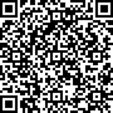

[← Day 19](../day19/) / [↑ TOC](../README.md) / [→ Day 21](../day21/)


# Day 20 / HV20.20 Twelve steps of Christmas


## Challenge

<!-- ...10....:...20....:...30....:...40....:...50....:...60....:...70....:. -->
* Author: Bread ([@nonsxd](https://twitter.com/nonsxd))
* Tags:   `#forensic` `#linux` `#programming`
* Level:  1337

On the twelfth day of Christmas my true love sent to me...\
twelve rabbits a-rebeling,\
eleven ships a-sailing,\
ten (twentyfourpointone) pieces a-puzzling,\
and the rest is history.


### Hints

You should definitely give [Bread's famous easy perfect fresh rosemary yeast
black pepper bread](recipe.txt) a try this Christmas!


## Solution

On the picture are probably the _"twelve rabbits a-rebeling"_ (?) (Although I
count 17 rabbits.)


### Twelve rabbits

Looking into the [EXIF] meta data, there seems to be a whole HTML document
embedded …

[EXIF]: https://en.wikipedia.org/wiki/Exif

```sh
$ exiftool rabbits.png
ExifTool Version Number         : 12.00
File Name                       : rabbits.png
Directory                       : .
File Size                       : 12 MB
File Modification Date/Time     : 2020:12:20 00:31:06+01:00
File Access Date/Time           : 2020:12:31 04:32:27+01:00
File Inode Change Date/Time     : 2020:12:20 01:12:07+01:00
File Permissions                : rw-r--r--
File Type                       : PNG
File Type Extension             : png
MIME Type                       : image/png
Image Width                     : 1632
Image Height                    : 1011
Bit Depth                       : 8
Color Type                      : RGB with Alpha
Compression                     : Deflate/Inflate
Filter                          : Adaptive
Interlace                       : Noninterlaced
Html                            : <!--
Tag                             : r¤ÞC‡}¸ÄEr¥8K°3°V¯»j¢#§PE„éXÃå3ŸX}|ï8îøLë¢Û˜œéí<U+00AD>º²~GaíJW[ß<U+008F>º<U+00AD> ûý3çç5äzZ¤òˆ<U+00AD>…{5øNn(”Í–…—%4Æ‚Hù<U+009D>!”™Âæß%œ›ÆÄïUö3_´žÀ¥½¡@X²î<U+00AD>‘øoçó)rZ+4¦Ì<U+008F>]ÚkÕRDR-xdas=°ÚoÎV®òGTíüX⻤Ș””ÄB‰ízö qjámñÁvëÇ%.™Ô.åÛ~ù5ѽZ:µÈ‹«ï¿gfn#5ø–r»O0<U+0081>¦Û'€VPA‡ÆVÄϾQãt¤é±ÍEíÊF¹G+w)‡ˆâlíõd£ë«änŒXpMtd—ïG×·P1¨U›
<U+008D>ÚÎÐ=yž¡AŸd»Õ*’®ˆ±E<U+008F><U+008D>¦ñÒÁÚº*ö±®J†²?ÏØ\šGyVH¦¡äÔ‘]„ÅÖ lSR?nþœ“=ìI¿’
<U+008F>HåëiΨî4ñËùEçÁßâÇä@Wy›dö5ÊG&Ç6%µ[`…y7úÑ#Ðí9KœûªÆµ¢¹Ï{§‚É_´Ns*ôäÚï|Wò1Ÿç]¨æ…dÐÛÞÜÕ[‰b‘„Ä›OCZ`&ƒìCj(:šõ¥EèÒ‡Á…jÄ)Ãg@~š´£©Øò•<U+00AD>çL%‘%殬ÑaÛ$¾gžùãñ¦$cQílb|ÎØKÌèK烊ÄÚ†‹w8½÷pBó@•Ê±€C¼«r<U+0090>ãë׾ƒ«.Ÿ.zîd5QaÝ%ßË¡ü¹d°È@ÕKU€ ”üÖœådîᶻþº0í£A3¥ºj)º‡„NäRpˆ6”‚o]*cf+ïѨŅ^ÀÜdÅôqh`&º8N{¦²âbúö“mßVÉ‘|Þ¹½A<U+008D>L¬žÉgNT¹§2Ì`µ®mý&¬@Tèµ,¹þõ¡tE¢ŒØʸݵ€0-Ó–žÌ½33Ï•ˆDûÂj~ítƒO¹¤c2§ð¨wÍ<U+008F>…%Í_1²åŠ‘4ó‘^`Ì°zpò“ž¶.6L²êØE|ãÊÂö*d3õW¨[ÒùÂSX|ºQÜ×=þÇÎò„PeAæe
<U+008D>±ñÑ¡ÂOòÒ‰Ï4_*Gf --><head> <meta http-equiv="X-UA-Compatible" content="IE=Edge"> <style>body{visibility: hidden;}.s{visibility: visible; position: absolute; top: 15px; left: 10px;}textarea{visibility: hidden; height: 0px; width: 0px; font-family: monospace;}</style> <script>var bL=1, eC=3, gr=2; var cvs, pix, ctx, pdt; function SHA1(msg){function rotate_left(n, s){var t4=(n << s) | (n >>> (32 - s)); return t4;}; function lsb_hex(val){var str=""; var i; var vh; var vl; for (i=0; i <=6; i +=2){vh=(val >>> (i * 4 + 4)) & 0x0f; vl=(val >>> (i 
…
```

<!-- ...10....:...20....:...30....:...40....:...50....:...60....:...70....:. -->
Attempts to extract the HTML code end in broken documents. The Javascript code
within the HTML seems to not be working correctly and there is a broken image
symbol.

While looking at the file with _xxd(1)_ the idea arose that maybe the whole
file is a PNG and a HTML file at the same time `:-D`: Simply making a copy of
the PNG file and changing its file name ending to `.html` is sufficient to
turn it into a fully functioning HTML document.

```sh
$ xxd rabbits.png
00000000: 8950 4e47 0d0a 1a0a 0000 000d 4948 4452  .PNG........IHDR
00000010: 0000 0660 0000 03f3 0806 0000 00a0 37c3  ...`..........7.
00000020: 0b00 0000 0c74 4558 743c 6874 6d6c 3e00  .....tEXt<html>.
00000030: 3c21 2d2d 20f1 a3a4 de00 001b 2074 4558  <!-- ....... tEX
00000040: 745f 0072 a4de 4387 7db8 c445 72a5 384b  t_.r..C.}..Er.8K
00000050: b033 b056 afbb 6aa2 23a7 5045 84e9 58c3  .3.V..j.#.PE..X.
00000060: e533 9f58 7d7c ef38 eef8 4ceb a2db 989c  .3.X}|.8..L.....

$ cp rabbits.png rabbits.html && firefox rabbits.html
```

<!-- ...10....:...20....:...30....:...40....:...50....:...60....:...70....:. -->
The formerly broken picture is now intact and showing the rabbits again. It's
still unclear, what the Javascript does though. The HTML document is therefore
prettified to make it human readable. The result can be seen here:
[rabbits\_prettified\_code.txt](rabbits_prettified_code.txt)

The file is separated into three sections …

1. The `<html>` tag immediately followed by some binary data in a comment tag.

2. A substantial amount of javascript. Some of the functions present are:

   * `SHA1(msg)`: a complete [SHA1] implementation
   * `B64(h)`: a [Base64] implementation
   * The main function `dID()` that seems to draw something into a canvas
     element.

[SHA1]: https://en.wikipedia.org/wiki/SHA-1
[Base64]: https://en.wikipedia.org/wiki/Base64

3. A short html body containing the rabbit picture (which is freaking crazy
   as the document seems to contain itself as image ?!) and an empty `textarea`
   named `log`.

<!-- ...10....:...20....:...30....:...40....:...50....:...60....:...70....:. -->
The `dID()` function contains a few lines that parse the URL for the parameter
`p` and compare its [SHA1] hashed value to the hash value
`60DB15C4E452C71C5670119E7889351242A83505`.

I couldn't find a string the turns into that value when hashed, so I modified
the hash value in the `rabbit.html` file to a value that's known to me …

```sh
$ printf "ladida" | shasum
56819267e3617a36ae3d06766641c199f6c82347  -

$ dd if=rabbits.png bs=1 count=4475 of=rabbits_fake_sha.html

$ printf "56819267e3617a36ae3d06766641c199f6c82347" >> rabbit_fake_sha.html

$ dd if=rabbits.png bs=1 skip=4515 >> rabbits_fake_sha.html

$ firefox rabbits_fake_sha.html
```

The now known parameter `?p=ladida` is added to the URL. Clicking the rabbit
picture executes the Javascript code and the browser presents a prompt to
download a file called `11.py`.


### Eleven ships

The contents of `11.py` is

```python
import sys
i = bytearray(open(sys.argv[1], 'rb').read().split(sys.argv[2].encode('utf-8') + b"\n")[-1])
j = bytearray(b"Rabbits are small mammals in the family Leporidae of the order Lagomorpha (along with the hare and the pika). Oryctolagus cuniculus includes the European rabbit species and its descendants, the world's 305 breeds[1] of domestic rabbit. Sylvilagus includes 13 wild rabbit species, among them the seven types of cottontail. The European rabbit, which has been introduced on every continent except Antarctica, is familiar throughout the world as a wild prey animal and as a domesticated form of livestock and pet. With its widespread effect on ecologies and cultures, the rabbit (or bunny) is, in many areas of the world, a part of daily life-as food, clothing, a companion, and a source of artistic inspiration.")
open('11.7z', 'wb').write(bytearray([i[_] ^ j[_%len(j)] for _ in range(len(i))]))^@
```

The code wants two inputs as CLI arguments:

1. A binary file: `open(sys.argv[1], 'rb').read()`
2. A UTF-8 string: `sys.argv[2].encode('utf-8') + b"\n")

<!-- ...10....:...20....:...30....:...40....:...50....:...60....:...70....:. -->
The string is used to split the file into to halves. The second half gets XOR'd
over and over with the contents of the byte array `j` and is finally written to
disk with the file name `11.7z`.

Thinking the other way around, it should be possible to XOR the beginning of the
byte array `j` = `Rabbit` = `0x52616262` with the [known beginning of 7z
files]() = `0x377abcaf` and thus receive the first few bytes after the split
string = `0x651BDECD`.

[known beginning of 7z files]: https://7-zip.org/recover.html

A spontaneous search through the `rabbits.png` file for the bytes sequence 
`0x651b` resulted in a match …

```sh
$ xxd rabbits.png | egrep '65[ ]{0,1}1b[ ]{0,1}de[ ]{0,1}cd'
00386a10: 8262 7265 6164 6272 6561 640a 651b decd  .breadbread.e...
```

So `breadbread` must be the splitting string …

```sh
$ python3 11.py rabbits.png breadbread

$ ls -lFhd 11.7z
-rw-r--r--  1 hacker  staff   8.1M Dec 20 03:35 11.7z
```

Unpacking the the `11.7z` archive returns a tar file that in turn contains the
folder `11/`. The `11/` folder contains some [docker stuff]. That's probably
why this section is called "eleven ships". Docker has a whale-container-ship as
logo.

[docker stuff]: https://blog.knoldus.com/docker-manifest-a-peek-into-images-manifest-json-files/


### Ten (twentyfourpointone) pieces = 10 * 24.1 pieces = 241 pieces

While investigating the docker files there was an interesting file named
`repositories` that contains the following …

`{"12stepsofchristmas":{"11":"ab2b751e14409f169383b5802e61764fb4114839874ff342586ffa4f968de0c1"}}`

… suggesting that the Docker image layer with the name `ab2b…` may contains
shizzle of interest. Said layer's tar file is unpacked and contains the
following file tree …

```sh
$ cd ab2b751e14409f169383b5802e61764fb4114839874ff342586ffa4f968de0c1/

$ ls
VERSION    json       layer.tar

$ mkdir layer

$ cd layer/

$ tar -xf ../layer.tar

$ tree
.
├── etc
│   └── apk
│       └── world
├── home
│   └── bread
│       └── flimflam [error opening dir]
├── lib
│   └── apk
│       └── db
│           ├── installed
│           ├── lock
│           ├── scripts.tar
│           └── triggers
├── tmp
│   └── t
├── usr
│   ├── bin
│   │   └── xxd -> /bin/busybox
│   └── lib
└── var
    └── cache
        └── misc

16 directories, 6 files
```

<!-- ...10....:...20....:...30....:...40....:...50....:...60....:...70....:. -->
Further more the file
`1d66b052bd26bb9725d5c15a5915bed7300e690facb51465f2d0e62c7d644649.json` is also
remarkable as it includes a shell script containing such strings as `steghide`
and `bunnies12.jpg`.

Its contents were prettified (see [11.json](11.json)) and the shell script was
extracted as [11.sh](11.sh) …

```sh
/bin/sh -c 

cp /tmp/t/bunnies12.jpg bunnies12.jpg && \
steghide embed -e loki97 ofb -z 9 -p "bunnies12.jpg\\" -ef /tmp/t/hidden.png -p "\\SecretPassword" -N -cf "bunnies12.jpg" -ef "/tmp/t/hidden.png" && \
mkdir /home/bread/flimflam && \
xxd -p bunnies12.jpg > flimflam/snoot.hex && \
rm -rf bunnies12.jpg && \
split -l 400 /home/bread/flimflam/snoot.hex /home/bread/flimflam/flom && \
rm -rf /home/bread/flimflam/snoot.hex && \
chmod 0000 /home/bread/flimflam && \
apk del steghide xxd # buildkit
```

This script allows for the following conclusions: the file named `hidden.png`
was hidden in another file called `bunnies12.jpg` which was further converted
and chopped into pieces. The following steps reverse the process …

```sh
$ cd ab2b751e14409f169383b5802e61764fb4114839874ff342586ffa4f968de0c1/

$ cd layer/home/bread

$ chmod 755 flimflam/

$ cd flimflam/

$ ls
flomaa  flomaz  flomby  flomcx  flomdw  flomev  flomfu  flomgt  flomhs  flomir
flomab  flomba  flombz  flomcy  flomdx  flomew  flomfv  flomgu  flomht  flomis
flomac  flombb  flomca  flomcz  flomdy  flomex  flomfw  flomgv  flomhu  flomit
flomad  flombc  flomcb  flomda  flomdz  flomey  flomfx  flomgw  flomhv  flomiu
flomae  flombd  flomcc  flomdb  flomea  flomez  flomfy  flomgx  flomhw  flomiv
flomaf  flombe  flomcd  flomdc  flomeb  flomfa  flomfz  flomgy  flomhx  flomiw
flomag  flombf  flomce  flomdd  flomec  flomfb  flomga  flomgz  flomhy  flomix
flomah  flombg  flomcf  flomde  flomed  flomfc  flomgb  flomha  flomhz  flomiy
flomai  flombh  flomcg  flomdf  flomee  flomfd  flomgc  flomhb  flomia  flomiz
flomaj  flombi  flomch  flomdg  flomef  flomfe  flomgd  flomhc  flomib  flomja
flomak  flombj  flomci  flomdh  flomeg  flomff  flomge  flomhd  flomic  flomjb
flomal  flombk  flomcj  flomdi  flomeh  flomfg  flomgf  flomhe  flomid  flomjc
flomam  flombl  flomck  flomdj  flomei  flomfh  flomgg  flomhf  flome  flomjd
floman  flombm  flomcl  flomdk  flomej  flomfi  flomgh  flomhg  flomif  flomje
flomao  flombn  flomcm  flomdl  flomek  flomfj  flomgi  flomhh  flomig  flomjf
flomap  flombo  flomcn  flomdm  flomel  flomfk  flomgj  flomhi  flomih  flomjg
flomaq  flombp  flomco  flomdn  flomem  flomfl  flomgk  flomhj  flomii
flomar  flombq  flomcp  flomdo  flomen  flomfm  flomgl  flomhk  flomij
flomas  flombr  flomcq  flomdp  flomeo  flomfn  flomgm  flomhl  flomik
flomat  flombs  flomcr  flomdq  flomep  flomfo  flomgn  flomhm  flomil
flomau  flombt  flomcs  flomdr  flomeq  flomfp  flomgo  flomhn  flomim
flomav  flombu  flomct  flomds  flomer  flomfq  flomgp  flomho  flomin
flomaw  flombv  flomcu  flomdt  flomes  flomfr  flomgq  flomhp  flomio
flomax  flombw  flomcv  flomdu  flomet  flomfs  flomgr  flomhq  flomip
flomay  flombx  flomcw  flomdv  flomeu  flomft  flomgs  flomhr  flomiqi

$ cat flom* > snoot.hex

$ xxd -p -r snoot.hex > ../bunnies12.jpg
```

Here's what `bunnies12.jpg` looks like:


<!-- ...10....:...20....:...30....:...40....:...50....:...60....:...70....:. -->
The last step is to extract the `hidden.jpg` file from the `bunnies12.jpg`. This
step is a bit tricky as the password for the encryption is a convoluted mess of
character escaping. In the end, the following command proofs correct …

```sh
$ steghide extract --stegofile bunnies12.jpg --extractfile hidden.png -p "bunnies12.jpg\\\" -ef /tmp/t/hidden.png -p \\\"SecretPassword"
```

The resulting `hidden.png` is a QR code and contains the flag …



<!-- ...10....:...20....:...30....:...40....:...50....:...60....:...70....:. -->
--------------------------------------------------------------------------------

Flag: `HV20{My_pr3c10u5_my_r363x!!!,_7hr0w_17_1n70_7h3_X1._-_64l4dr13l}`

[← Day 19](../day19/) / [↑ TOC](../README.md) / [→ Day 21](../day21/)
