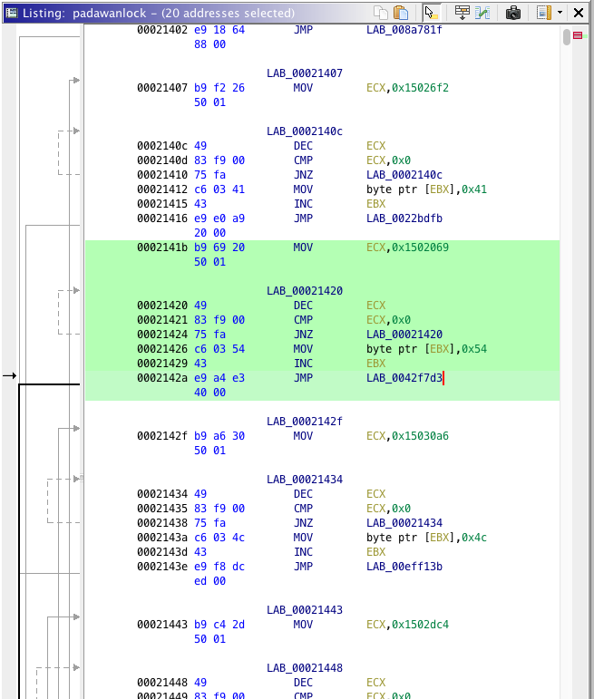

# Day 22 / HV20.22 Padawanlock


## Challenge

<!-- ...10....:...20....:...30....:...40....:...50....:...60....:...70....:. -->
* Author: inik
* Tag:    #reverse-engineering
* Level:  hard

A new apprentice Elf heard about "Configuration as Code". When he had to solve
the problem to protected a secret he came up with this "very sophisticated 
padlock".

[Download](Download.zip)


## Solution


### A strange quoting app

The archive contained a single file: An ELF x86 executable with the name
_padawanlock_:

```sh
$ file padawanlock
padawanlock: ELF 32-bit LSB pie executable Intel 80386, version 1 (SYSV), dynamically linked, interpreter /lib/ld-, BuildID[sha1]=56e8cc633ab14ebd1c6fdd3bfda3ebd100a6a45e, for GNU/Linux 3.2.0, stripped
```

When running the program, it asked for a 6 digit PIN. Upon entering a random
PIN it printed a seemingly random message:

```sh
$ ./padawanlock
PIN (6 digits): 123456
Unlocked secret is: _IMPERIAL_CRUISER.)}
```

While trying different numbers, a kind of pattern seems to emerge. The unlocked
secrets are usually some fragments or sometimes even complete of Star Wars 
quotes:

```sh
$ ./padawanlock
PIN (6 digits): 123456
Unlocked secret is: _IMPERIAL_CRUISER.)}

$ ./padawanlock
PIN (6 digits): 000000
Unlocked secret is: {WE_HAVE_NO_CHOICE,_GENERAL_CALRISSIAN!_OUR_CRUISERS_CANT_REPEL_FIREPOWER_OF_THAT_MAGNITUDE!}

$ ./padawanlock
PIN (6 digits): 000001
Unlocked secret is: FOR_ONCE,_LET_ME_LOOK_ON_YOU_WITH_MY_OWN_EYES.}

$ ./padawanlock
PIN (6 digits): 133742
Unlocked secret is: H;_THE_FOOL,_OR_THE_FOOL_WHO_FOLLOWS_HIM?}

$ ./padawanlock
PIN (6 digits): 983671
Unlocked secret is: RAL_ACKBAR{ITS_A_TRAP!}
```

The last examples show that if the right PIN is entered, a full quote would be
returned with the following pattern: `<speaker>{<quote>}`. It's quite evident,
that there is one quote who's speaker is `HV20` and who's quote is the flag.


### Looking into the abyss

Was is a bit surprising is the fact that `padawanlock` has a file size of a
whooping 354 MB. And don't get me wrong, it is actually filled with that much
code.

After looking into the program with Ghidra it became clear that almost the
whole executable consists of blocks of instructions of the following structure:



Such a block does basically the following:

1. Copy a big number to `ECX`.
2. Stupidly decrement the number until it is zero.
3. Write a single byte to the output buffer addressed by `EBX`.
4. Jump forwards or backwards to a different instruction block address.

Step 2 seems to simply slow down normal operation to a point were it's not
feasible to bruteforce the damn thing.

So the aim is probably to write a software that looks for specific starting
blocks – i.e. blocks that return `0x48` = `H` – and follow the jump addresses
if the continued sequence gives the string `HV20{`.


### Slipping into a pretty stupid approach

Since I was toying around with shell commands and scripts the whole time, I 
somehow missed an opportunity to switch to a sane programming language. In the
end, my solution was almost completly written in shell scripts which is slow
as hell even compared to other interpreted languages but whatever, right `:-)`

Before dealing with the actual extraction of bytes, the code was decomposed
into an assembler file with [distorm3]:

[distorm3]: https://github.com/gdabah/distorm

```python
from distorm3 import Decode, Decode16Bits, Decode32Bits, Decode64Bits

l = Decode(0x1000, open("padawanlock", "rb").read(), Decode32Bits)

for i in l:
    print ("0x%08x (%02x) %-20s %s" % (i[0], i[1], i[3], i[2]))
```

```sh
$ python3 ./decomposer.py > padawanlock.as
```

The first shell script searches in `padawanlock.as` for instruction blocks that
output the byte `0x48` = `H` and writes their memory addresses to the file 
`canditate_addrs.txt`. The instruction sequence 
`C6 03 48` = `MOV byte ptr [EBX], 0x48` is used as an identifier.

```sh
#!/bin/bash

grep 'c60348' padawanlock.as | grep -o '^0x........' > candidate_addrs.txt
```

The resulting candidates list has a length of `35579`.

The second shell script uses this address candidates to search for output 
sequences that continue in `V20{`. If it is successful, it prints the starting
address, calculates and prints the PIN and also uses a third shell script to
print the flag:

```sh
#!/bin/bash

function get_byte_and_addr_offset() {
	local addr=$1

	res="$(xxd -p -s $addr padawanlock | head -n 1)"
	local byte="${res:26:2}"
	local offset="0x${res:38:2}${res:36:2}${res:34:2}${res:32:2}"
    	offset=$(python3 twos_comp.py $offset)
	offset=$(( offset + 20 ))

	printf "%s %s" "$byte" "$offset"
}

function print_res() {
	local byte="$1"
	local char="$(echo "$1" | xxd -p -r)"
	local addr="$2"
	printf "Byte: %s\nChar: %s\nAddr Offset: %x\n" $byte $char $addr
}


for line in $(cat candidate_addrs.txt); do
	addr=$(printf '0x%x' $(( line - 0x100b )))
	addr="0x89c707"

	init=$addr
	echo -n "."
	res=( $(get_byte_and_addr_offset $addr) )
	addr=$(( addr + res[1] ))
	res=( $(get_byte_and_addr_offset $addr) )
	if [ "${res[0]}" == "56" ]; then
		addr=$(( addr + res[1] ))
        	res=( $(get_byte_and_addr_offset $addr) )
		if [ "${res[0]}" == "32" ]; then
			addr=$(( addr + res[1] ))
                	res=( $(get_byte_and_addr_offset $addr) )
			if [ "${res[0]}" == "30" ]; then 
                        	addr=$(( addr + res[1] ))
                        	res=( $(get_byte_and_addr_offset $addr) )
				echo ""
				echo "Flag start address: $init"
				echo "PIN: $(( (init - 0x124b) / 20 ))"
				echo -n "Flag: "
				./print_pw.sh $init
				exit 0
			fi
		fi
	fi
done

echo "Failed to find HV20"
exit 1
```

The mentioned third shell script to print the flag:

```sh
#!/bin/bash

start_offset="0x124b"
start=$start_offset
if [ ! -z $1 ]; then
	start="$1"
fi

function get_byte_and_addr_offset() {
	local addr=$1

	res="$(xxd -p -s $addr padawanlock | head -n 1)"
	local byte="${res:26:2}"
	local offset="0x${res:38:2}${res:36:2}${res:34:2}${res:32:2}"
    offset=$(python3 twos_comp.py $offset)
	offset=$(( offset + 20 ))

	printf "%s %s" "$byte" "$offset"
}

function print_res() {
	local byte="$1"
	local char="$(echo "$1" | xxd -p -r)"
	local addr="$2"
	printf "Byte: %s\nChar: %s\nAddr Offset: %x\n" $byte $char $addr
}
	
addr=$start
char=''
while [ ! "$char" == "7d" ]; do
	res=( $(get_byte_and_addr_offset $addr) )
	char="${res[0]}"
	print_res ${res[0]} ${res[1]}
	addr=$(( addr + res[1] ))
done | grep 'Char' | sed 's/Char: \(.\).*/\1/g' | xxd -p | sed 's/0a//g' | xxd -p -r

echo ""
exit 0
```

The successfull run of searching the flag took approximately 1 hour. Not 
exactly my finest hour but a flag is a flag.

```sh
$ ./search_flag.sh
… [1 hour later] ...............................................................
................................................................................
................................................................................
..................
Flag start address: 0x89c707
PIN: 451235
Flag: HV20{C0NF1GUR4T10N_AS_C0D3_N0T_D0N3_R1GHT}
................................................................................
................................................................................
................................................................................
…
```


<!-- ...10....:...20....:...30....:...40....:...50....:...60....:...70....:. -->
--------------------------------------------------------------------------------

Flag: `HV20{C0NF1GUR4T10N_AS_C0D3_N0T_D0N3_R1GHT}`

