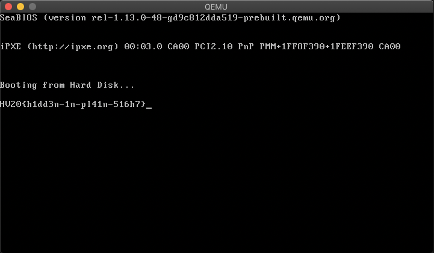

# Hid 02 / HV20.H2 Oh, another secret!


## Challenge

<!-- ...10....:...20....:...30....:...40....:...50....:...60....:...70....:. -->
Who knows where this could be hidden... Only the best of the best shall find it!

* Level: hard


## Solution

On day 08 in the `file.gif` there is a code section where a lot of screen 
scrolling is happening as if something existing is being wiped out. It made me
curious and I set a break point in the debugger at an address directly before 
the section: `0x7c3a`

```sh
$ qemu-system-x86_64 -s -S -m 512 -hda file.gif
```

```sh
$ gdb
(gdb) target remote localhost:1234
(gdb) set architecture i8086
(gdb) break *0x7c3a
(gdb) cont
Continuing.

Breakpoint 1, 0x0000000000007c3a in ?? ()
```

Here's what the qemu screen was displaying:



--------------------------------------------------------------------------------

Flag: `HV20{h1dd3n-1n-pl41n-516h7}`

